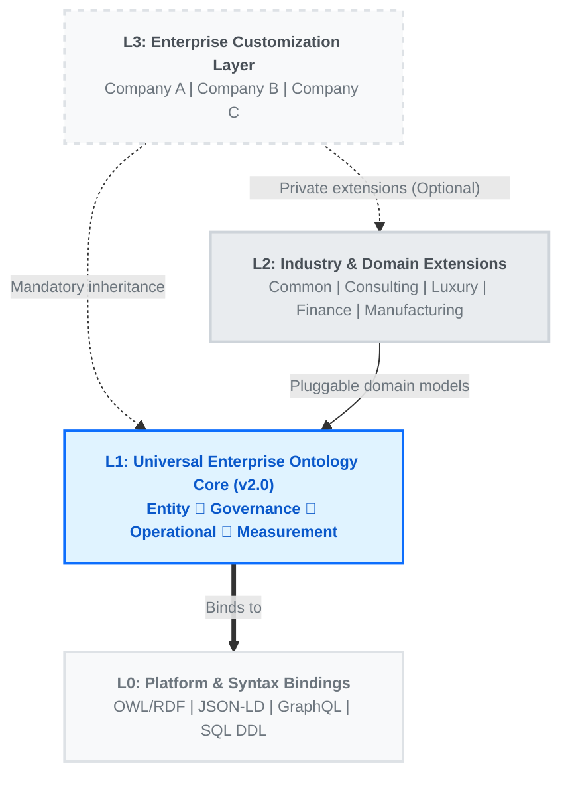

<div align="center">

# 🌐 Universal Ontology Definition

**An Open, Standardized Four-Layer Enterprise Ontology Framework**

> *Anti-entropy by design — structured, governed, and built to scale.*

[](https://opensource.org/licenses/Apache-2.0)
[](#)
[](#contributing)

*[中文](./README_CN.md) | **English***

</div>

---

## 📖 What is Universal Ontology Definition?

Universal Ontology Definition (UOD) is an **open, standardized four-layer enterprise ontology framework** designed to provide a unified conceptual modeling foundation for enterprise knowledge graphs, semantic layers, master data management, and AI Agent knowledge bases.

### 🔴 The Problem

Enterprise digitalization commonly faces:

- **Inconsistent concept definitions** — Different teams use different terms for the same objects, making cross-system reuse difficult.
- **Industry knowledge silos** — Industry-specific knowledge is scattered with no standardized extension mechanism.
- **Customization vs. standardization conflicts** — Enterprise-specific needs continuously erode the underlying structure.
- **Platform lock-in** — Ontology definitions tied to a single serialization format, limiting interoperability.

### 🟢 The Solution: Four-Layer Architecture



---

## ✨ Key Features

- 🏗️ **Four-Layer Separation** — Stable semantic core, pluggable Industry and Domain Extension, free enterprise customization, and multi-platform bindings.
- 🛡️ **Anti-Entropy by Design** — 4 abstract domain roots, hard class caps, governance rules, and CI validation prevent ontology sprawl.
- 📐 **Standardized Definition Format** — Unified JSON Schema with lifecycle management (`status`, `since`, `deprecated_since`).
- 🔗 **Inheritance & Extension** — L2 extends L1, L3 extends L1+L2, with generalized domain/range relations.
- ⚙️ **Platform Bindings** — L0 provides ready-to-use OWL/RDF, JSON-LD, GraphQL, and SQL mappings.
- 🌍 **Bilingual Support** — All concepts include Chinese and English labels and definitions.
- 🤝 **Community-Driven** — Anyone can contribute Industry and Domain Extensions, platform bindings, or improve core definitions.
- 🖥️ **Ontology Studio** — Production-ready visual web workspace for browsing and managing all ontology layers.
---

## 🖥️ Ontology Studio

A production-ready **Next.js web application** for visually browsing, searching, and managing the ontology across all four layers.

- **Multi-Layer Visual Editors** — Interactive node graphs for L0 (Platform), L1 (Core), L2 (Extensions), and L3 (Enterprise) layers.
- **Live GitHub Sync** — Reads ontology data directly from the repository via GitHub API in real time.
- **Role-Based Access Control** — GitHub OAuth with three roles (Admin / Editor / Viewer) backed by Netlify Blobs.
- **Public Read-Only Access** — Anonymous users can browse the full ontology; only the admin panel requires login.

> **Live Demo**: [ontologystudio.netlify.app](https://ontologystudio.netlify.app) | Source code in [`studio/`](studio/).

### Local Development

```bash
cd studio
npm install
```

Create `studio/.env.local` with the following variables:

```env
GITHUB_TOKEN=ghp_your_personal_access_token
GITHUB_REPO_OWNER=your-github-username
GITHUB_REPO_NAME=universal-ontology-definition
GITHUB_ID=your_oauth_app_client_id
GITHUB_SECRET=your_oauth_app_client_secret
NEXTAUTH_URL=http://localhost:3000
NEXTAUTH_SECRET=any-random-secret-string
SUPER_ADMIN=your-github-username
```

Then start the dev server:

```bash
npm run dev
```

> `GITHUB_ID` and `GITHUB_SECRET` come from a [GitHub OAuth App](https://github.com/settings/developers). Set the callback URL to `http://localhost:3000/api/auth/callback/github`.

### Deploy to Netlify

1. **Create a new site** on [Netlify](https://app.netlify.com/) linked to your GitHub repo.
2. **Build settings** (auto-detected from `netlify.toml`):
   - Base directory: `studio`
   - Build command: `npm run build`
   - Publish directory: `studio/.next`
3. **Environment variables** — add the same variables as above in Netlify's site settings (Settings > Environment variables), but set `NEXTAUTH_URL` to your deployed URL (e.g. `https://your-site.netlify.app`).
4. Deploy. The `@netlify/plugin-nextjs` plugin handles SSR and serverless functions automatically.

> Permission data (user roles) is stored in [Netlify Blobs](https://docs.netlify.com/blobs/overview/) — no external database required.

---

## 📁 Repository Structure

```text
.
├── l1-core/                    # L1 Universal Enterprise Ontology Core
│   └── universal_ontology_v1.json
├── l2-extensions/              # L2 Industry & Domain Extensions
│   ├── consulting/             #   └── Consulting Industry
│   ├── financial-services/     #   └── Financial Services (Banking, Insurance, Asset Mgmt)
│   ├── fnb/                    #   └── Food & Beverage
│   ├── healthcare/             #   └── Healthcare (Clinical, Pharma, Medical Devices)
│   ├── luxury-goods/           #   └── Luxury Goods
│   ├── manufacturing/          #   └── Manufacturing (Factory Ops, MES, Quality)
│   ├── technology/             #   └── Technology (SaaS, DevOps, AI/ML)
│   └── _template/              #   └── Extension Contribution Template
├── l3-enterprise/              # L3 Enterprise Examples
│   ├── acme-tech-solutions/    #   └── Sample Virtual Enterprise
│   └── _template/              #   └── Enterprise Layer Template
├── l0-platform/                # L0 Platform & Syntax Bindings
│   ├── owl-rdf/                #   └── OWL 2 / RDF Turtle
│   ├── json-ld/                #   └── JSON-LD Context
│   ├── graphql/                #   └── GraphQL Schema
│   ├── sql/                    #   └── PostgreSQL DDL
│   └── _template/              #   └── Platform Binding Template
├── scripts/                    # Tooling & Automation
│   ├── validate_governance.py  #   └── L1 Governance Validator
│   ├── validate_l3.py          #   └── L2/L3 Referential Integrity Validator
│   ├── merge_layers.py         #   └── Multi-Layer Merger (L1+L2+L3 → 5 formats)
│   ├── visualize_ontology.py   #   └── Interactive HTML Visualization Generator
│   ├── diff_ontology.py        #   └── Structural Diff Between Versions
│   ├── export_for_llm.py       #   └── LLM Export (System Prompt, Tools, RAG Chunks)
│   ├── export_neo4j.py         #   └── Neo4j Cypher Import Generator
│   └── json_to_owl.py          #   └── JSON → OWL/RDF Turtle Converter
├── studio/                     # Ontology Studio (Next.js Web App)
│   ├── app/                    #   └── Pages, layouts, API routes
│   ├── components/             #   └── React components (editors, flow graphs)
│   └── lib/                    #   └── Auth, permissions, GitHub integration
├── docs-site/                  # MkDocs Documentation Site Source
└── schema/                     # JSON Schema Validation
    ├── core_schema.json
    └── extension_schema.json
```

---

## 🚀 Quick Start

### 1️⃣ Understanding Core Ontology

L1 v2.0 defines **24 classes** and **13 generalized relations**, organized into 4 abstract semantic domains. Within Entity, `Party` and `Resource` act as intermediate abstractions used as relation signatures (e.g. `owns: Party → Resource`). In total: **6 abstract classes** (4 domain roots + Party + Resource) and **18 concrete leaf classes**.

| Domain | Semantic Focus | Classes |
|:---|:---|:---|
| 🟦 **Entity** | Physical & logical entities | `Party` *(abstract)*, `Person`, `Organization`, `OrgUnit`, `Resource` *(abstract)*, `ProductService`, `Asset`, `DataObject`, `Document`, `SystemApplication` |
| 🟨 **Governance** | Control & compliance | `Policy`, `Rule`, `Control`, `Risk` |
| 🟩 **Operational** | Execution & capabilities | `Role`, `Capability`, `Process`, `Event` |
| 🟪 **Measurement** | Outcomes & metrics | `Goal`, `KPI` |

### 2️⃣ Using Platform Bindings (L0)

Choose the binding that matches your technology stack:

| Platform | Use Case | Directory |
|:---|:---|:---|
| **OWL/RDF** | Knowledge graphs, SPARQL queries | [`platform/owl-rdf/`](l0-platform/owl-rdf/) |
| **JSON-LD** | REST APIs, Linked Data | [`platform/json-ld/`](l0-platform/json-ld/) |
| **GraphQL** | Modern API layers, Frontend | [`platform/graphql/`](l0-platform/graphql/) |
| **SQL DDL** | Relational DBs, Data warehouses | [`platform/sql/`](l0-platform/sql/) |

### 3️⃣ Using Industry & Domain Extensions

Browse the `l2-extensions/` directory and select the appropriate industry package. Each extension declares its parent through the `extends` field:

```json
{
  "layer": "L2_consulting_industry_extension",
  "version": "1.0.0",
  "extends": "L1_universal_organization_ontology",
  "classes": [
    {
      "id": "ConsultingFirm",
      "label_zh": "咨询公司",
      "parent": "Organization",
      "definition": "An enterprise entity providing professional consulting services"
    }
  ]
}
```

### 4️⃣ Contributing a New Extension

1. Copy `l2-extensions/_template/` as your starting point.
2. Follow the [Extension Development Guide](docs-site/extensions/create-extension.md).
3. Validate against `schema/extension_schema.json`.
4. Submit a Pull Request! *(See [CONTRIBUTING.md](CONTRIBUTING.md))*

---

## 📚 Full Ontology Creation & Update Guide

> For the full step-by-step walkthrough with detailed examples in Chinese, see **[README_CN.md — Ontology 创建与更新完整指南](README_CN.md#-ontology-创建与更新完整指南)**.

### End-to-End Workflow

```text
1. Identify parent dependencies (L1 core, L2 extensions)
2. Copy template → l2-extensions/_template/ or l3-enterprise/_template/
3. Inherit parent classes via the "parent" field
4. Define domain-specific classes (PascalCase IDs, bilingual labels)
5. Define relations with "specializes" inheritance chain (snake_case IDs)
6. Add sample instances (type must reference a concrete, non-abstract class)
7. Validate: JSON Schema → Governance rules → Referential integrity
8. Generate derived formats (OWL/RDF, Neo4j, LLM exports)
9. Version management & release
```

### Validation & Export Commands

```bash
# L1 governance rules (class caps, naming, relation density, etc.)
python scripts/validate_governance.py

# L2/L3 referential integrity (9 rules: parent refs, domain/range, aliases, cycles)
python scripts/validate_l3.py --all

# Generate all derived formats
python scripts/json_to_owl.py                                          # OWL/RDF Turtle
python scripts/export_neo4j.py l1-core/universal_ontology_v1.json      # Neo4j Cypher
python scripts/export_for_llm.py l1-core/universal_ontology_v1.json    # LLM (prompt, tools, RAG)
python scripts/visualize_ontology.py                                   # Interactive HTML
```

> **Pro Tip**: A working L3 sample is available at [`l3-enterprise/acme-tech-solutions/`](l3-enterprise/acme-tech-solutions/) — a fictional technology consulting company demonstrating the full workflow.

---

## 🗂️ Available Industry & Domain Extensions

| Industry | Directory | Classes | Relations | Status |
|:---|:---|:---:|:---:|:---|
| **Consulting** | [`l2-extensions/consulting/`](l2-extensions/consulting/) | 54 | 45 |  |
| **Financial Services** | [`l2-extensions/financial-services/`](l2-extensions/financial-services/) | 30 | 12 |  |
| **Food & Beverage** | [`l2-extensions/fnb/`](l2-extensions/fnb/) | 19 | 7 |  |
| **Healthcare** | [`l2-extensions/healthcare/`](l2-extensions/healthcare/) | 28 | 10 |  |
| **Luxury Goods** | [`l2-extensions/luxury-goods/`](l2-extensions/luxury-goods/) | 39 | 14 |  |
| **Manufacturing** | [`l2-extensions/manufacturing/`](l2-extensions/manufacturing/) | 27 | 11 |  |
| **Technology** | [`l2-extensions/technology/`](l2-extensions/technology/) | 29 | 12 |  |

*🌟 **We're looking for community contributions!** Retail, Education, Real Estate, Logistics, Energy, and more.*

---

## ⚙️ Available Platform Bindings

| Platform | Directory | Format | Status |
|:---|:---|:---|:---|
| **OWL/RDF** | [`platform/owl-rdf/`](l0-platform/owl-rdf/) | Turtle (`.ttl`) |  |
| **JSON-LD** | [`platform/json-ld/`](l0-platform/json-ld/) | Context (`.jsonld`) |  |
| **GraphQL** | [`platform/graphql/`](l0-platform/graphql/) | Schema (`.graphql`) |  |
| **SQL DDL** | [`platform/sql/`](l0-platform/sql/) | PG DDL (`.sql`) |  |

*🌟 **Want more?** Protobuf, Avro, Neo4j Cypher, and more are welcome contributions!*

---

## 🤝 Contributing

We welcome all contributions! Please read [CONTRIBUTING.md](CONTRIBUTING.md) to learn about:

- Proposing changes to the Core Ontology
- Submitting new Industry & Domain Extensions
- Contributing new Platform Bindings
- Coding standards and PR workflow

---

## 📄 License & Acknowledgments

### License
This project is licensed under the [Apache License 2.0](LICENSE). You are free to:
- ✅ Use commercially
- ✅ Modify and distribute
- ✅ Build private L3 enterprise layers on top

### Acknowledgments
The ontology design draws inspiration from:
- [OWL 2 Web Ontology Language](https://www.w3.org/TR/owl2-overview/)
- [RDF 1.1 Concepts and Abstract Syntax](https://www.w3.org/TR/rdf11-concepts/)
- [Schema.org](https://schema.org/)
- [ArchiMate](https://www.opengroup.org/archimate-forum/archimate-overview)

---

<div align="center">
<b>If this project helps you, please give it a ⭐ Star!</b>
</div>
