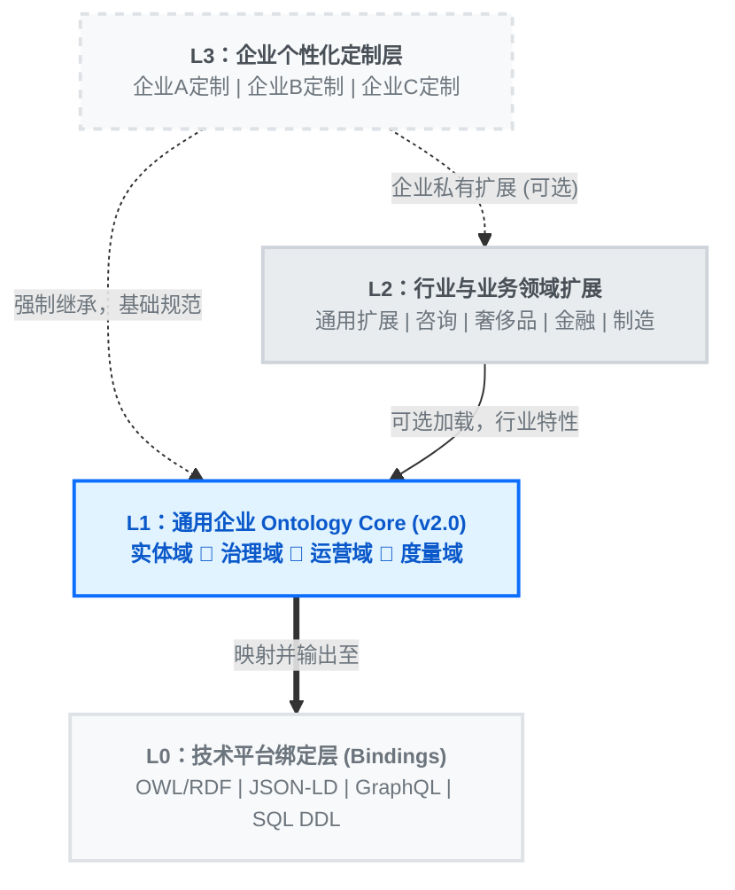

<div align="center">

# 🌐 Universal Ontology Definition

**开放、标准化的四层企业本体定义框架**

> *反熵设计 — 结构化、治理化、可扩展。*

[](https://opensource.org/licenses/Apache-2.0)
[](#)
[](#contributing)

*[English](./README.md) | **中文***

</div>

---

## 📖 什么是 Universal Ontology Definition？

Universal Ontology Definition (UOD) 是一个**开放、标准化的四层企业本体定义框架**，旨在为企业知识图谱、语义层、主数据管理和 AI Agent 知识底座提供统一的概念建模基础。

### 🔴 痛点

在企业数字化建设中，我们常面临以下痛点：

- **概念定义不统一** — 不同团队用不同术语描述同一对象，跨系统、跨项目难以复用。
- **行业知识难复用** — 行业特性沉淀分散，缺乏标准化的扩展机制。
- **企业个性化与通用规范冲突** — 定制需求持续侵蚀底层结构。
- **平台锁定** — 本体定义绑定在单一序列化格式，难以跨平台互操作。

### 🟢 解决方案：四层架构



---

## 📑 目录

- [核心特性](#-核心特性)
- [仓库结构](#-仓库结构)
- [快速开始](#-快速开始)
- [Ontology 创建与更新完整指南](#-ontology-创建与更新完整指南)
- [已有行业与业务领域扩展](#️-已有行业与业务领域扩展)
- [已有平台绑定](#️-已有平台绑定)
- [贡献指南](#-contributing)
- [License 与致谢](#-license-与致谢)

---

## ✨ 核心特性

- 🏗️ **四层分离架构** — 通用底座稳定不变，行业包按需加载，企业层自由定制，多平台绑定。
- 🛡️ **反熵设计** — 4 个抽象域根、类数量硬上限、治理规则、CI 校验，防止 ontology 膨胀。
- 📐 **标准化定义格式** — 统一的 JSON Schema，支持生命周期管理（`status`, `since`, `deprecated_since`）。
- 🔗 **继承与扩展机制** — L2 继承 L1，L3 继承 L1+L2，泛化的 domain/range 关系。
- ⚙️ **平台绑定层** — L0 提供即用的 OWL/RDF、JSON-LD、GraphQL 和 SQL DDL 映射。
- 🌍 **双语支持** — 所有概念均提供中英文标签与定义。
- 🤝 **社区驱动** — 欢迎任何人贡献行业与业务领域扩展、平台绑定或完善 Core 定义。

---

## 📁 仓库结构

```text
.
├── core/                       # L1 通用企业 Ontology Core
│   └── universal_ontology_v1.json
├── extensions/                 # L2 行业 & 领域 Extension
│   ├── consulting/             #   └── 咨询行业与业务领域扩展
│   ├── luxury-goods/           #   └── 奢侈品行业与业务领域扩展
│   └── _template/              #   └── Extension 贡献模板
├── enterprise/                 # L3 Enterprise Example（公开示例）
│   ├── acme-tech-solutions/    #   └── 示例虚拟企业
│   ├── _template/              #   └── 企业层定制模板
│   └── README.md
├── platform/                   # L0 技术平台绑定层
│   ├── owl-rdf/                #   └── OWL 2 / RDF Turtle 序列化
│   ├── json-ld/                #   └── JSON-LD Context 定义
│   ├── graphql/                #   └── GraphQL Schema 定义
│   ├── sql/                    #   └── PostgreSQL DDL 映射
│   └── _template/              #   └── 平台绑定贡献模板
├── scripts/                    # CI & 治理自动化
│   ├── validate_governance.py  #   └── L1 治理规则校验器
│   └── json_to_owl.py          #   └── JSON → OWL/RDF Turtle 转换器
├── docs-site/                  # MkDocs 文档站点源码
└── schema/                     # JSON Schema 校验
    ├── core_schema.json
    └── extension_schema.json
```

---

## 🚀 快速开始

### 1️⃣ 了解 Core Ontology

L1 v2.0 定义了 **24 个类**（4 个抽象域 + 20 个具体类）和 **12 种泛化关系**，归入 4 大语义域：

| 域 | 语义焦点 | 具体类 |
|:---|:---|:---|
| 🟦 **实体 Entity** | 物理与逻辑实体 | `Party`, `Person`, `Organization`, `OrgUnit`, `Resource`, `ProductService`, `Asset`, `DataObject`, `Document`, `SystemApplication` |
| 🟨 **治理 Governance** | 控制与合规避险 | `Policy`, `Rule`, `Control`, `Risk` |
| 🟩 **运营 Operational** | 执行与支撑能力 | `Role`, `Capability`, `Process`, `Event` |
| 🟪 **度量 Measurement** | 目标与结果导向 | `Goal`, `KPI` |

### 2️⃣ 使用平台绑定 (L0)

根据你的技术栈选择合适的绑定格式：

| 平台 | 适用场景 | 目录 |
|:---|:---|:---|
| **OWL/RDF** | 知识图谱、SPARQL 查询、语义网 | [`platform/owl-rdf/`](platform/owl-rdf/) |
| **JSON-LD** | REST API、关联数据、Web 标准 | [`platform/json-ld/`](platform/json-ld/) |
| **GraphQL** | 现代 API 层、前端集成 | [`platform/graphql/`](platform/graphql/) |
| **SQL DDL** | 关系型数据库、数据仓库 | [`platform/sql/`](platform/sql/) |

---

## 📋 Ontology 创建与更新完整指南

> **💡 适用对象：**需要创建 **L2 行业与业务领域扩展** 或 **L3 企业定制层** 的开发者和架构师。
> 以下流程以创建 L3 企业定制层为主要示例，L2 的流程类似。

### 🔄 总览：端到端工作流

```text
步骤 1. 确认上级依赖
   ↓
步骤 2. 复制模板 & 初始化
   ↓
步骤 3. 继承上级类
   ↓
步骤 4. 定义企业/行业特有类
   ↓
步骤 5. 定义关系（带 specializes 继承链）
   ↓
步骤 6. 添加实例
   ↓
步骤 7. JSON Schema 校验
   ↓
步骤 8. 治理规则检查
   ↓
步骤 9. 引用完整性检查
   ↓
步骤 10. 生成 OWL/RDF Turtle 格式
   ↓
步骤 11. 可选：Protégé / TopBraid 验证
   ↓
步骤 12. 版本管理与发布
```

<br/>

### 步骤 1：确认上级依赖

在创建任何新的 Ontology 之前，必须首先确定你的**继承链**：

#### L2 行业与业务领域扩展
- **必须**继承 `L1_universal_organization_ontology`

#### L3 企业定制层
- **必须**继承 `L1_universal_organization_ontology`
- **必须**至少继承一个相关 `L2` 行业与业务领域扩展

```json
// L3 示例：一家科技咨询公司同时继承 L1 Core 和 L2 咨询行业与业务领域扩展
"extends": [
  "L1_universal_organization_ontology_v2",
  "L2_consulting_industry_extension_v1"
]
```

<br/>

### 步骤 2：复制模板 & 初始化目录

#### L2 行业与业务领域扩展
```bash
cp -r extensions/_template/ extensions/your-industry/
```

#### L3 企业定制层
```bash
# 公开示例放在 enterprise/
cp -r enterprise/_template/ enterprise/your-company/

# 私有/保密的放在 private_enterprise/（已被 .gitignore 排除）
cp -r enterprise/_template/ private_enterprise/your-company/
```

**初始化 JSON 文件的元数据头：**
```json
{
  "$schema": "../../schema/extension_schema.json",
  "layer": "L3_enterprise_customization",
  "enterprise": {
    "name": "Your Company Name",
    "name_zh": "公司中文名",
    "id": "ENT_YOUR_COMPANY_001",
    "headquarters": "上海",
    "industry": "Your Industry"
  },
  "version": "1.0.0",
  "extends": [
    "L1_universal_organization_ontology_v2",
    "L2_your_industry_extension_v1"
  ],
  "compatible_core_version": "2.0.0",
  "compatible_extension_version": "1.1.0",
  "description": "中文描述",
  "description_en": "English description"
}
```

<br/>

### 步骤 3：从上级继承类

**核心原则：** L3 类的 `parent` 必须指向 **L1 或 L2 中已存在的类**。不要凭空创建无根类。

**常见的继承模式：**

| 你需要定义的概念 | 应该继承的 L1/L2 parent |
|:---|:---|
| 特有组织单元（事业部、团队） | `OrgUnit` (L1) |
| 特有项目类型 | `Engagement` (L2 咨询) |
| 特有角色 | `Role` (L1) 或 `ConsultantRole` (L2) |
| 特有交付物 | `Deliverable` (L2) 或 `Document` (L1) |
| 特有方法论/框架 | `Methodology`/`Framework` (L2) |
| 特有系统 | `SystemApplication` (L1) |
| 特有策略、风险、度量 | `Policy` / `Risk` / `KPI` (L1) |

**示例：**
```json
{
  "id": "CloudMigrationEngagement",
  "label_zh": "云迁移项目",
  "label_en": "Cloud Migration Engagement",
  "parent": "Engagement",        // ← 继承自 L2
  "definition": "帮助客户将传统 IT 基础设施迁移到云端的咨询项目",
  "definition_en": "A consulting engagement helping clients migrate IT infrastructure to the cloud"
}
```

> **⚠️ 避免的常见错误：**
> 1. **不要**将具体实例（如"北京办公室"）建模为类 — 应放入 `sample_instances`。
> 2. **不要**创建 `parent` 为 `null` 的类 — 只有 L1 的 4 个抽象域根允许这样做。
> 3. **不要**在 L3 中重新定义 L1/L2 已有的类 — 直接引用即可。

<br/>

### 步骤 4：定义企业/行业特有类

| 字段 | 规则 | 示例 |
|:---|:---|:---|
| `id` | PascalCase，正则 `^[A-Z][a-zA-Z0-9]*$` | `SolutionArchitectRole` |
| `label_zh` | 中文标签 | `解决方案架构师角色` |
| `label_en` | 英文标签 | `Solution Architect` |
| `parent` | 必须引用 L1/L2 中已有的非抽象类 | `ConsultantRole` |
| `definition` | 中/英文定义（≥ 5 字符） | `负责技术方案设计的角色` |

<br/>

### 步骤 5：定义关系（带 specializes 继承链）

关系是 ontology 的核心连接。L3 层的关系应当声明与 L1/L2 关系的**特化（specializes）关系**。

| 字段 | 规则 | 示例 |
|:---|:---|:---|
| `id` | snake_case，正则 `^[a-z][a-z0-9_]*$` | `designs_solution_for` |
| `domain` | 源类 ID（来自 L1/L2/L3） | `SolutionArchitectRole` |
| `range` | 目标类 ID（来自 L1/L2/L3） | `Engagement` |
| `specializes`| 上级关系 ID（带层级标注） | `staffed_on (L2)` |

**示例：**
```json
{
  "id": "reviewed_by_arb",
  "label_zh": "经架构评审委员会审核",
  "label_en": "reviewed by ARB",
  "domain": "ArchitectureBlueprint",
  "range": "ArchitectureReviewBoard",
  "specializes": "reviewed_by (L2)",
  "definition": "架构蓝图须经架构评审委员会审核通过"
}
```

<br/>

### 步骤 6：添加实例

实例（`sample_instances`）代表真实或示例性的具体对象。它的 `type` **禁止指向抽象类**（如 Entity, Resource）。
如果涉及真实客户项目，请使用匿名化处理（如 `[匿名银行 A]`）。

<br/>

### 步骤 7-9：全面校验框架

开发完成后，依次运行严格的校验机制，确保 ontology 的质量与反熵一致性：

1. **JSON Schema 校验：**
   文件必须遵守 `schema/extension_schema.json`的格式约束。
2. **L1 治理规则检查：**
   ```bash
   python scripts/validate_governance.py
   ```
   检测硬指标：类数量上限、禁止野兽类（无根节点）、关系密度上限等。
3. **引用完整性检查：**
   确保所有的 `parent`, `domain`, `range`, `specializes`, `type` 的引用目标都切实存在且未被废弃。

<br/>

### 步骤 10：生成 OWL/RDF Turtle 格式

JSON 是 Ontology 的**源格式**，OWL/RDF Turtle (`.ttl`) 是用于语义网工具（Protégé、TopBraid、Stardog）的**发布格式**。

```bash
# 批量转换所有文件，或通过传参转换单个文件
python scripts/json_to_owl.py enterprise/acme-tech-solutions/acme_tech_solutions_ontology_v1.json
```

> **🔥 重要说明：**
> 脚本为纯 Python 3 实现，零外部依赖。`.ttl` 文件为机器自动生成，**切勿手动编辑 `.ttl` 文件**；每次修改 `.json` 后，**必须重新运行**转换脚本。

<br/>

### 📖 完整示例：创建一个 L3 虚拟企业 Ontology

> 以下以虚构公司"**极客方舟科技 (Acme Tech Solutions)**"为示例，完整演示 L3 层创建流程。
> 完整源文件见 [`enterprise/acme-tech-solutions/`](enterprise/acme-tech-solutions/)

只需复制模板，通过 JSON 修改，并执行校验脚本即可快速构筑出具备：
- 4个事业部、4个业务线、3个办公室
- 多种咨询交付物与项目类型特化
- 对齐行业 L2 知识体 的完整私有图谱。

---

## 🗂️ 已有行业与业务领域扩展

| 行业 | 目录 | 类数量 | 关系数量 | 状态 |
|:---|:---|:---:|:---:|:---|
| **咨询行业** | [`extensions/consulting/`](extensions/consulting/) | 40+ | 34 |  |
| **奢侈品行业** | [`extensions/luxury-goods/`](extensions/luxury-goods/) | 38 | 14 |  |

*🌟 **期待社区贡献更多行业扩展！** 如金融、制造、零售、医疗、教育等。*

---

## ⚙️ 已有平台绑定

| 平台 | 目录 | 格式 | 状态 |
|:---|:---|:---|:---|
| **OWL/RDF** | [`platform/owl-rdf/`](platform/owl-rdf/) | Turtle (`.ttl`) |  |
| **JSON-LD** | [`platform/json-ld/`](platform/json-ld/) | Context (`.jsonld`) |  |
| **GraphQL** | [`platform/graphql/`](platform/graphql/) | Schema (`.graphql`) |  |
| **SQL DDL** | [`platform/sql/`](platform/sql/) | PG DDL (`.sql`) |  |

*🌟 **还想要更多？** 欢迎贡献 Protobuf、Avro、Neo4j Cypher 等平台绑定！*

---

## 🤝 Contributing

我们欢迎所有形式的贡献！请阅读 [CONTRIBUTING.md](CONTRIBUTING.md) 了解：

- 如何提议修改 Core Ontology
- 如何提交新的行业与业务领域扩展
- 如何贡献新的平台绑定
- 代码规范与 PR 流程

---

## 📄 License 与致谢

### License
本项目采用 [Apache License 2.0](LICENSE) 许可证。您可以自由地：
- ✅ 商业使用
- ✅ 修改和分发
- ✅ 基于此创建企业私有的 L3 定制层

### 致谢
本项目的 Ontology 设计参考了以下标准与规范：
- [OWL 2 Web Ontology Language](https://www.w3.org/TR/owl2-overview/)
- [RDF 1.1 Concepts and Abstract Syntax](https://www.w3.org/TR/rdf11-concepts/)
- [Schema.org](https://schema.org/)
- [ArchiMate](https://www.opengroup.org/archimate-forum/archimate-overview)

---

<div align="center">
<b>如果这个项目对你有帮助，请给个 ⭐ Star！</b>
</div>
