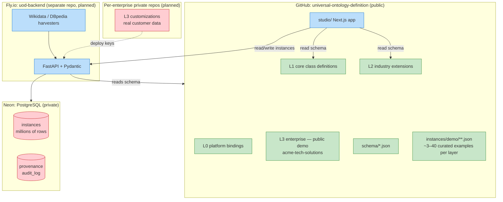

# Data Architecture | 数据架构

UOD separates **schema** (slow-moving, human-curated) from **instance data** (fast-moving, mostly machine-generated). This page explains the two-tier model and where each piece lives.

UOD 将**模式**（缓慢演进、人工治理）与**实例数据**（快速变化、主要由机器产生）分开存储。本页解释这套两层模型以及每部分的归属。

---

## Two-tier model | 两层模型



## What lives where | 各组件职责

| Component | Lives in | Visibility | Change rate | Governance |
|---|---|---|---|---|
| **L0/L1/L2 class definitions** | `universal-ontology-definition` repo | Public | Slow (months) | PR review, G-01 to G-08 |
| **L3 demo (acme-tech-solutions)** | `universal-ontology-definition` repo | Public | Slow | PR review |
| **L3 real (per-customer)** | Private per-enterprise repos | Private | Medium | Customer-controlled |
| **`schema/*.json`** | `universal-ontology-definition` repo | Public | Rare | PR review |
| **`instances/demo/**.json`** | `universal-ontology-definition` repo | Public | Rare | PR review + `validate_instances.py` |
| **Real instances** | Neon Postgres | Private (auth required) | Constant | Auto-validated + admin review |
| **API server** | `uod-backend` repo, deployed to Fly.io | Public code, auth-gated runtime | Per release | PR review |
| **Studio UI** | `universal-ontology-definition` repo (this one), deployed to Netlify | Public code, auth-gated edit | Per release | PR review |

## Why this split | 为什么这样拆分

The class structure of an enterprise ontology is fundamentally different from its instance data:

| Aspect | Schema (L1/L2/L3 class defs) | Instances |
|---|---|---|
| Size | KB-MB | GB-TB |
| Change rate | Months between updates | Seconds (during harvesting) |
| Producer | Humans + governance committee | Harvesters, admins, integrations |
| Citability | Stable URIs forever | URIs OK, but provenance via DB |
| Deletion needed? | No (history is valuable) | Yes (GDPR, retractions, corrections) |
| Best storage | Git (versioned, diffable) | Postgres (indexed, queryable) |

Mixing them — for example, by storing 10 million harvested Organization instances inside `l1-core/universal_ontology_v1.json` — would make the repo unclonable, the Studio unresponsive, and audit trails impossible.

类结构与实例数据本质上是两种东西：前者像合同条款（少且稳定），后者像账本记录（多且持续追加）。把它们塞在同一份 Git 文件里既无法版本化前者，也无法支撑后者的体量与生命周期管理。

## What `instances/demo/` is for | demo 实例的用途

The files under `instances/demo/` are intentionally a small, hand-curated set:

`instances/demo/` 下的文件是一组小而精的人工示例：

1. **Documentation examples** — `docs-site/` renders them inline so readers see "what a real Organization looks like".
   **文档示例** — `docs-site/` 直接嵌入展示。
2. **Integration test fixtures** — CI does not need to call any external API to verify the merge pipeline end-to-end.
   **集成测试 fixture** — CI 无需外网即可端到端验证 merge 流水线。
3. **Backend smoke seed** — a freshly deployed `uod-backend` can seed itself from `instances/demo/` to be useful before any harvester has run.
   **后端冷启动种子** — 新部署的 `uod-backend` 可以用 demo 数据 seed 出基础状态。

> They are NOT a complete dataset. Each concrete class has 3–5 demo entries at most. The real catalog of harvested instances lives in Postgres.

> 它们**不是**完整数据集。每个具体类最多 3-5 条示例。真实采集到的实例库存在 Postgres 中。

## Instance file format | 实例文件格式

Every file under `instances/demo/` follows [`schema/instance_schema.json`](https://github.com/ramphias/universal-ontology-definition/blob/master/schema/instance_schema.json) and contains:

```jsonc
{
  "$schema": "../../schema/instance_schema.json",
  "layer": "L2_consulting_industry_extension",
  "source_file": "l2-extensions/consulting/consulting_extension_v1.json",
  "instances": [
    {
      "id": "consulting_firm_apex",
      "type": "ConsultingFirm",      // must be a concrete (non-abstract) class
      "label_en": "Apex Strategy",
      "label_zh": "巅峰战略",
      "source": "manual",            // provenance: where did this come from?
      "source_url": "https://...",   // citation (required if source != manual)
      "confidence": 1.0,             // 1.0 for curated, lower for auto-harvested
      "status": "accepted",          // candidate / accepted / rejected / archived
      "harvested_at": "2026-05-26T00:00:00Z",
      "verified_by": "curated",      // GitHub login or "curated" for legacy
      "verified_at": "2026-05-26T00:00:00Z"
    }
  ]
}
```

The same shape (extended with relational tables) becomes the storage model on the backend Postgres database — see the planned `uod-backend` repo.

后端 Postgres 用同样的形状（再加关系表）存储——详见规划中的 `uod-backend` 仓库。

## Validation chain | 校验链

```
PR opens
   ↓
CI runs (.github/workflows/ontology-validate.yml)
   ├─ schema-validate job
   │   ├─ validate_schema.py       ← class definitions against schema/
   │   └─ validate_instances.py    ← instances/demo/ against schema/instance_schema.json
   │                                 + type is non-abstract + ids unique
   └─ validate job
       ├─ validate_governance.py   ← G-01..G-08 on L1
       ├─ validate_l3.py --all     ← parent/relation references
       ├─ check_docs_sync.py       ← docs counts match JSON
       └─ merge_layers.py          ← end-to-end merge of acme L3
```

Real instance writes (POST to `uod-backend`) go through the same `instance_schema.json` plus DB-level constraints (foreign keys to class registry, soft-delete audit).

真实实例写入（向 `uod-backend` POST）会走相同的 `instance_schema.json` 校验，加上 DB 层约束（类注册表的外键、软删除审计）。

## Migration history | 迁移历史

Before Phase A.1, every layer JSON had an inline `sample_instances` array. This worked while the project had ~100 demo entries but would not scale.

Phase A.1 之前，每个 layer JSON 内嵌 `sample_instances` 数组。这套在 ~100 条 demo 实例时勉强够用，但无法扩展。

Phase A.1 did:

1. Extracted 129 entries from L1 + 6 L2 + 1 L3 into 8 files under `instances/demo/`.
2. Renamed `label → label_en` to align with class definitions.
3. Added provenance fields (`source`, `confidence`, `harvested_at`, etc.).
4. Marked the legacy `sample_instances` field `deprecated: true` in `core_schema.json` and `extension_schema.json`. Removal is scheduled for v3.0.0.

A.1 阶段执行了：1) 把 8 个文件里的 129 条实例抽到 `instances/demo/`；2) `label → label_en` 对齐类定义；3) 加 provenance 字段；4) 旧 `sample_instances` 字段在两个 schema 里标记 deprecated，v3.0.0 移除。

## Next phases | 下一阶段

- **A.2** — Bootstrap `uod-backend` repo with FastAPI + Postgres + JWT auth.
- **A.3** — Studio reads instances from backend instead of file system.
- **B** — Structure-audit cron agent (read-only, posts daily report).
- **C** — Wikidata mapping registry.
- **D** — First harvester worker (Organization class end-to-end).

详见 `docs-site/architecture/` 的后续 RFC（待补）。
