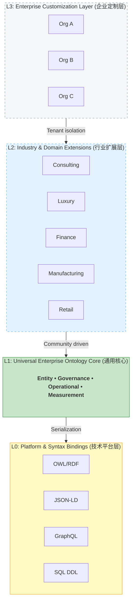

# Four-Layer Architecture Model | 四层架构模型

Universal Ontology Definition uses a **Technical—Universal—Industry—Enterprise** four-layer architecture to balance the tension between standardization and customization.
Universal Ontology Definition 采用**技术层—通用层—行业层—企业层**四层架构，解决“技术—共性—行业—个性”的平衡问题。

## Layer Overview | 架构总览

## L0 — Platform & Syntax Bindings | 技术平台绑定层

| Dimension (维度) | Description (说明) |
|:---|:---|
| **Purpose (定位)** | Map L1 abstract semantic concepts to concrete technology formats (将 L1 抽象语义概念映射到具体技术实现格式) |
| **Scope (范围)** | OWL/RDF serialization, JSON-LD Context, GraphQL Schema, SQL DDL, etc. |
| **Stability (稳定性)** | High — updates follow technology standards evolution (高 — 随技术标准演进而更新) |
| **Modify Rights (修改权)** | Project maintainers + platform contributors (项目维护者 + 平台贡献者) |
| **Relationship (关系)** | L1 concepts are mapped to executable technical formats through L0 (L1 的概念模型通过 L0 映射为可执行的技术格式) |

!!! info "What L0 Solves | L0 解决的问题"
    L0 separates *"what is an Organization"* (semantic definition) from *"how is Organization expressed in OWL / how is the table created in SQL"* (technical implementation). This enables the same semantic core to serve knowledge graphs, REST APIs, relational databases, and more simultaneously. 
    将“什么是 Organization”（语义定义）与“Organization 在 OWL 中怎么表达、在 SQL 中怎么建表”（技术实现）分离，使同一套语义核心可同时服务于知识图谱、REST API、关系数据库等不同技术栈。

## L1 — Universal Enterprise Ontology Core | 通用企业 Ontology Core

| Dimension (维度) | Description (说明) |
|:---|:---|
| **Purpose (定位)** | Universal concept model applicable to all enterprises (适用于所有企业的通用概念模型) |
| **Scope (范围)** | Party, Organization, Role, Capability, Process, Business Objects, Data, Systems, Governance, Risk, Goals, Metrics |
| **Stability (稳定性)** | Very high — only accepts long-term stable, cross-industry abstractions (极高 — 只接纳长期稳定、跨行业共性的抽象) |
| **Modify Rights (修改权)** | Only project maintainers, requires community review (仅项目维护者可修改，需社区投票审核) |
| **Inheritance (继承)** | All L2 and L3 must inherit from L1 (所有 L2、L3 必须继承 L1) |

## L2 — Industry & Domain Extensions | 行业与业务领域扩展

| Dimension (维度) | Description (说明) |
|:---|:---|
| **Purpose (定位)** | Industry or domain-specific concept extensions (特定行业或业务领域的概念扩展) |
| **Scope (范围)** | Industry-specific entities, relations, roles, processes, rules, metrics |
| **Stability (稳定性)** | High — requires cross-enterprise reuse validation (较高 — 需要跨企业复用证明) |
| **Modify Rights (修改权)** | Industry contributors + project maintainers (行业贡献者 + 项目维护者) |
| **Inheritance (继承)** | Extends L1 via the `extends` field (继承 L1，通过 `extends` 字段声明) |

## L3 — Enterprise Customization Layer | 企业个性化定制层

| Dimension (维度) | Description (说明) |
|:---|:---|
| **Purpose (定位)** | Enterprise-private custom extensions (企业私有的定制扩展) |
| **Scope (范围)** | Enterprise-specific objects, system mappings, organizational constraints, internal terminology |
| **Stability (稳定性)** | Flexible — enterprise self-managed (灵活 — 企业自主管理) |
| **Modify Rights (修改权)** | Enterprise administrators (企业管理员) |
| **Inheritance (继承)** | Extends L1 + selected L2 extensions (继承 L1 + 所选 L2 Extension) |

## Design Principles | 设计原则

1. **Stability First (稳定优先)** — L1 only accommodates long-term stable abstractions (L1 只容纳长期稳定的抽象)
2. **Extensibility First (可扩展优先)** — L2/L3 extend through inheritance, never overwrite upstream semantics (下层通过继承扩展，不改写上层语义)
3. **Governance First (治理优先)** — Every concept and relation has an owner, version, and audit trail (每个概念和关系都有 owner、版本和审计轨迹)
4. **Consumer First (消费优先)** — Serve queries, reviews, publishing, API integration, and AI Agent consumption (服务查询、评审、发布、API 集成与可计算消费)
5. **Security First (安全优先)** — Enterprise layer is logically isolated with approval-based publishing (企业层逻辑隔离，审批发布)
6. **Platform Agnostic (平台无关)** — L1 semantic definitions are independent of any technology platform; L0 handles platform binding (L1 语义定义独立于任何技术平台，L0 负责平台绑定)
