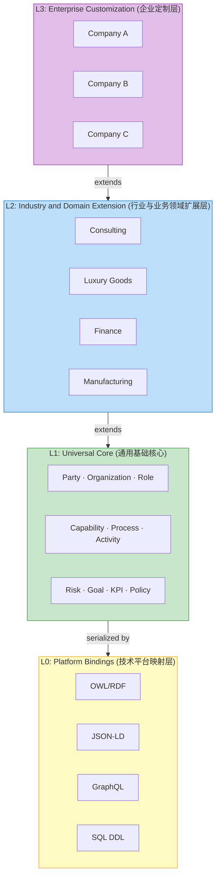

# Architecture | 架构

This section provides a deep dive into the four-layer architecture of Universal Ontology Definition.
本章节深入解析 Universal Ontology Definition 的四层架构设计。

## Sections | 目录

- [Four-Layer Model | 四层架构模型](four-layer-model.md) — Detailed explanation of each layer / 各层设计的详细说明
- [Inheritance & Extension | 继承与扩展](inheritance.md) — How layers relate to each other / 本体的语义继承关系和扩展规则
- [Platform Bindings (L0) | 平台绑定](platform-bindings.md) — Technical serialization details / 技术格式的具体绑定细节
