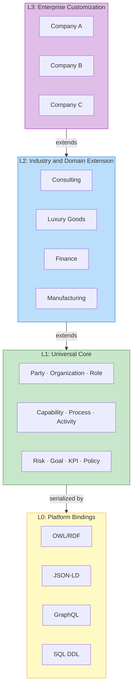

# Architecture

This section provides a deep dive into the four-layer architecture of Universal Ontology Definition.

## Sections

- [Four-Layer Model](four-layer-model.md) — Detailed explanation of each layer
- [Inheritance & Extension](inheritance.md) — How layers relate to each other
- [Platform Bindings (L0)](platform-bindings.md) — Technical serialization details
