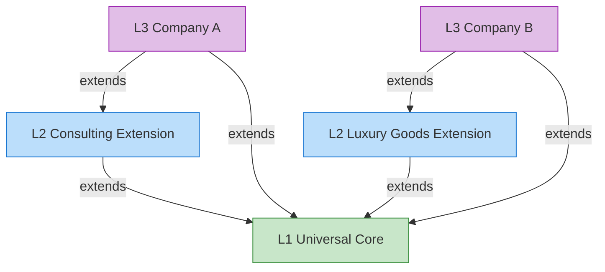

# Inheritance & Extension | 继承与扩展

This page explains how the layers relate to each other through semantic inheritance and how extension works.
本节详述各层如何通过语义继承相互关联。

## Semantic Inheritance Chain (L1 → L2 → L3) | 语义继承链



## Rules | 继承规则

| Operation (操作) | Allowed? (是否允许) | Details (详情) |
|:---|:---|:---|
| **Add** new classes/relations (新增类/关系) | ✅ Yes | Lower layers can freely add new elements (下层可自由新增元素) |
| **Inherit** from upper layer (继承上层) | ✅ Automatic | Lower layers inherit all published elements (下层自动继承上层所有已发布元素) |
| **Override** labels/aliases (覆盖标签/别名) | ✅ Yes | Metadata like labels can be customized (允许覆盖元数据) |
| **Override** core definitions (覆盖核心定义) | ❌ No | Core definitions are immutable by default (核心定义默认不可覆盖) |
| **Delete** upper layer elements (删除上层元素) | ❌ No | Protected elements cannot be removed (保护元素禁止删除) |

## Class Inheritance Example | 类的继承示例

```json
// L1 Core 定义 (L1 Core)
{ "id": "Organization", "label_zh": "组织", "parent": null }

// L2 咨询行业扩展 (extends Organization)
{ "id": "ConsultingFirm", "label_zh": "咨询公司", "parent": "Organization" }

// L2 奢侈品行业扩展 (extends Organization)
{ "id": "LuxuryBrand", "label_zh": "奢侈品牌", "parent": "Organization" }

// L3 企业定制 (extends ConsultingFirm)
{ "id": "MyCompany_DigitalPractice", "label_zh": "数字化实践部", "parent": "ConsultingFirm" }
```

Visualized as a tree (树状结构试图):

```
Party (L1)
├── Person (L1)
└── Organization (L1)
    ├── OrgUnit (L1)
    ├── ConsultingFirm (L2)
    │   ├── StrategyConsulting (L2)
    │   └── MyCompany_DigitalPractice (L3)
    └── LuxuryBrand (L2)
        └── MyLuxuryHouse (L3)
```

## Conflict Resolution | 冲突处理

| Scenario (场景) | Resolution Strategy (处理策略) |
|:---|:---|
| L2 class name conflicts with L1 (L2 类名与 L1 冲突) | System warning, require rename or prefix (系统预警，要求重命名或使用前缀) |
| Two L2 extensions have same class name (不同 L2 同名冲突) | Conflict detection at load time, manual arbitration required (加载时冲突检测，需人工裁决) |
| L3 attempts to redefine L1/L2 core concept (L3 重定义核心概念) | Blocked with warning, requires approval (拦截并提示，需审批) |
| L0 bindings inconsistency (L0 绑定间不一致) | L1 JSON definition is the **source of truth** (以 L1 JSON 定义为唯一事实来源) |

## Version Management | 版本管理

- Each layer has its own **independent version number** following [Semantic Versioning](https://semver.org/) / 每层独立版本号，遵循语义化版本控制
- L1 version upgrades automatically trigger **impact analysis** on L2/L3 / L1 版本升级时，自动分析对下游的影响
- L0 binding versions follow L1 to ensure synchronization / L0 绑定版本跟随 L1 版本确保同步
- Major changes generate an **Impact Report** to notify downstream consumers / 重大变更生成 Impact Report 通知下游
```
