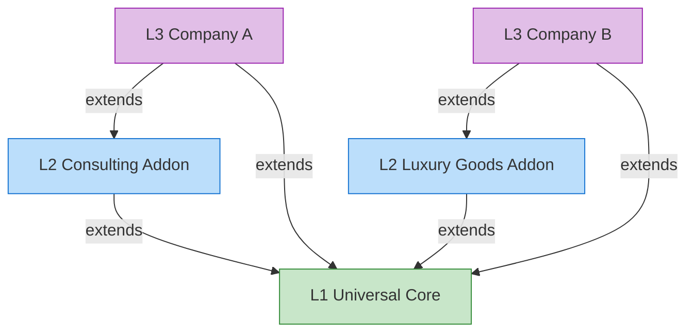

# Inheritance & Extension

This page explains how the layers relate to each other through semantic inheritance and how extension works.

## Semantic Inheritance Chain (L1 → L2 → L3)



## Rules

| Operation | Allowed? | Details |
|:---|:---|:---|
| **Add** new classes/relations | ✅ Yes | Lower layers can freely add new elements |
| **Inherit** from upper layer | ✅ Automatic | Lower layers inherit all published elements |
| **Override** labels/aliases | ✅ Yes | Metadata like labels can be customized |
| **Override** core definitions | ❌ No | Core definitions are immutable by default |
| **Delete** upper layer elements | ❌ No | Protected elements cannot be removed |

## Class Inheritance Example

```json
// L1 Core
{ "id": "Organization", "label_zh": "组织", "parent": null }

// L2 Consulting Addon — extends Organization
{ "id": "ConsultingFirm", "label_zh": "咨询公司", "parent": "Organization" }

// L2 Luxury Goods Addon — extends Organization
{ "id": "LuxuryBrand", "label_zh": "奢侈品牌", "parent": "Organization" }

// L3 Enterprise — extends ConsultingFirm
{ "id": "MyCompany_DigitalPractice", "label_zh": "数字化实践部", "parent": "ConsultingFirm" }
```

Visualized as a tree:

```
Party (L1)
├── Person (L1)
└── Organization (L1)
    ├── OrgUnit (L1)
    ├── ConsultingFirm (L2)
    │   ├── StrategyConsulting (L2)
    │   └── MyCompany_DigitalPractice (L3)
    └── LuxuryBrand (L2)
        └── MyLuxuryHouse (L3)
```

## Conflict Resolution

| Scenario | Resolution Strategy |
|:---|:---|
| L2 class name conflicts with L1 | System warning, require rename or prefix |
| Two L2 addons have same class name | Conflict detection at load time, manual arbitration required |
| L3 attempts to redefine L1/L2 core concept | Blocked with warning, requires approval |
| L0 bindings inconsistency | L1 JSON definition is the **source of truth** |

## Version Management

- Each layer has its own **independent version number** following [Semantic Versioning](https://semver.org/)
- L1 version upgrades automatically trigger **impact analysis** on L2/L3
- L0 binding versions follow L1 to ensure synchronization
- Major changes generate an **Impact Report** to notify downstream consumers
