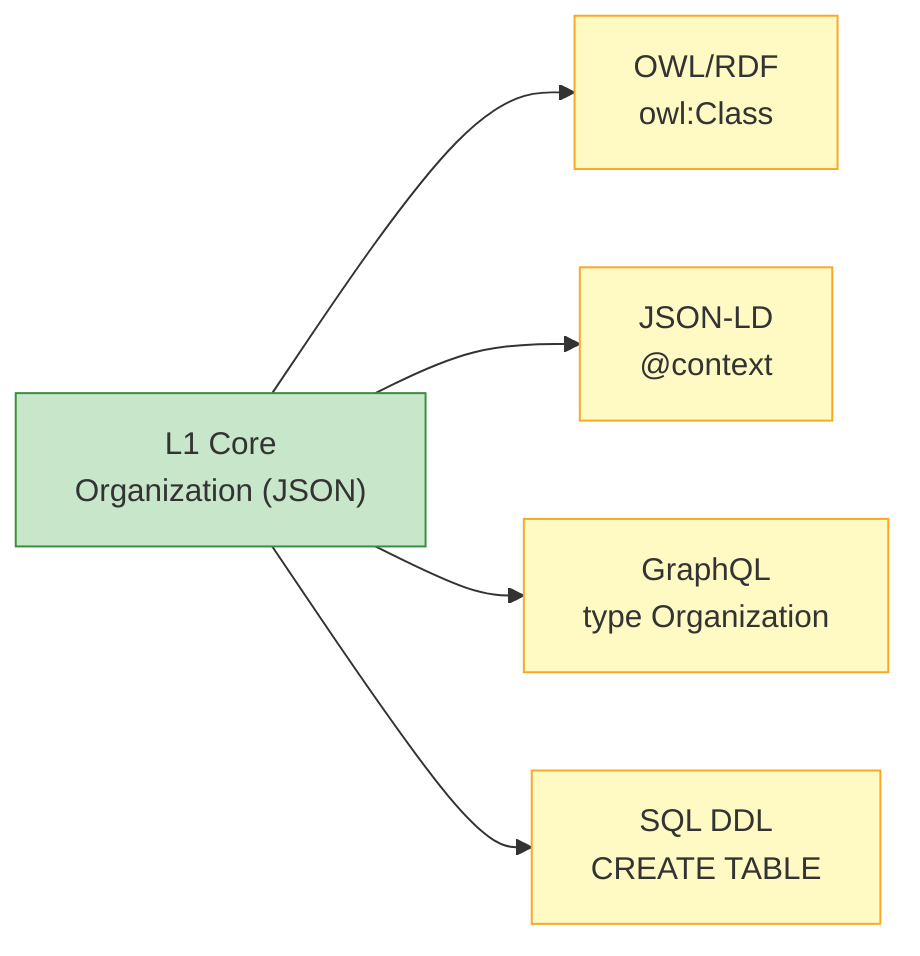

# Platform Bindings (L0) | 平台绑定层 (L0)

The L0 layer provides pre-built serializations of the L1 semantic model for different technology platforms.
L0 层提供了 L1 语义模型到不同技术平台的预构建序列化映射。

## Available Bindings | 可用绑定

| Platform | Format | Use Case (适用场景) | Directory |
|:---|:---|:---|:---|
| **OWL/RDF** | Turtle (.ttl) | Knowledge graphs, SPARQL, Semantic Web (知识图谱，语义网) | `platform/owl-rdf/` |
| **JSON-LD** | JSON-LD Context (.jsonld) | REST APIs, Linked Data, Web standards (Web 标准数据) | `platform/json-ld/` |
| **GraphQL** | GraphQL Schema (.graphql) | Modern API layers, Frontend integration (现代 API 层集成) | `platform/graphql/` |
| **SQL DDL** | PostgreSQL DDL (.sql) | Relational databases, Data warehouses (关系数据库或数据仓库) | `platform/sql/` |

## How L0 Works | L0 工作原理

L0 does **not** participate in the semantic inheritance chain (L1 → L2 → L3). Instead, it provides a **parallel mapping** from the L1 semantic model to concrete technology formats.
L0 不参与语义继承链（L1 → L2 → L3），而是提供从 L1 模型到具体技术格式的**平行映射**。



## Binding Examples | 映射示例

The same `Organization` class expressed across different L0 bindings:
同一个 `Organization` 类在不同 L0 绑定中的表现：

=== "OWL/RDF (Turtle)"

    ```turtle
    uod:Organization a owl:Class ;
        rdfs:subClassOf uod:Party ;
        rdfs:label "Organization"@en ;
        rdfs:label "组织"@zh ;
        rdfs:comment "A legal or non-legal organization entity"@en .
    ```

=== "JSON-LD"

    ```json
    {
      "@context": {
        "Organization": "https://github.com/ramphias/universal-ontology-definition/core/Organization",
        "subClassOf": { "@id": "rdfs:subClassOf", "@type": "@id" }
      }
    }
    ```

=== "GraphQL"

    ```graphql
    type Organization implements Party {
      id: ID!
      labelZh: String!
      labelEn: String!
      legalName: String
      industry: String
      units: [OrgUnit!]!
    }
    ```

=== "SQL DDL"

    ```sql
    CREATE TABLE organization (
        id UUID PRIMARY KEY REFERENCES party(id),
        legal_name VARCHAR(500),
        industry VARCHAR(100),
        founded_date DATE
    );
    ```

## Contributing a New Binding | 贡献新绑定

Want to add Protobuf, Avro, Neo4j Cypher, or another format?
想要添加 Protobuf、Avro、Neo4j Cypher 等其他格式的映射？

1. Copy `platform/_template/` as your starting point / 复制模板作为起点
2. Map all 24 L1 classes and 12 relations to your target format / 映射所有的类和关系
3. Include a `README.md` explaining usage and limitations / 提供包含使用说明的 README.md
4. Submit a Pull Request / 提交 PR 

See the [Contributing Guide](../guides/contributing.md) for details.
