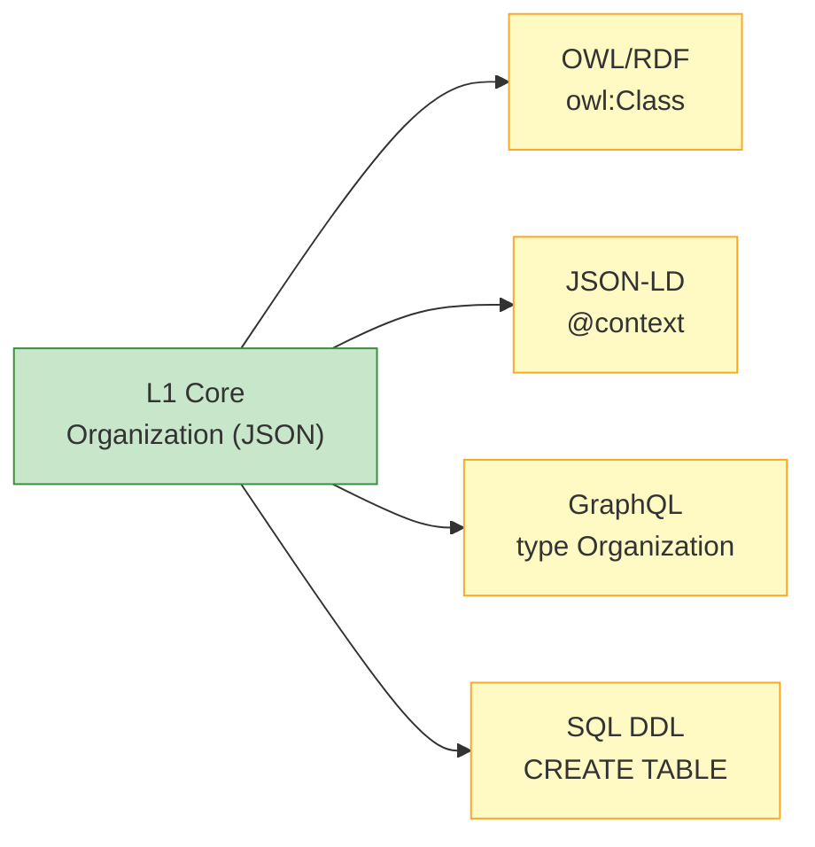

# Platform Bindings (L0)

The L0 layer provides pre-built serializations of the L1 semantic model for different technology platforms.

## Available Bindings

| Platform | Format | Use Case | Directory |
|:---|:---|:---|:---|
| **OWL/RDF** | Turtle (.ttl) | Knowledge graphs, SPARQL, Semantic Web | `platform/owl-rdf/` |
| **JSON-LD** | JSON-LD Context (.jsonld) | REST APIs, Linked Data, Web standards | `platform/json-ld/` |
| **GraphQL** | GraphQL Schema (.graphql) | Modern API layers, Frontend integration | `platform/graphql/` |
| **SQL DDL** | PostgreSQL DDL (.sql) | Relational databases, Data warehouses | `platform/sql/` |

## How L0 Works

L0 does **not** participate in the semantic inheritance chain (L1 → L2 → L3). Instead, it provides a **parallel mapping** from the L1 semantic model to concrete technology formats.



## Binding Examples

The same `Organization` class expressed across different L0 bindings:

=== "OWL/RDF (Turtle)"

    ```turtle
    uod:Organization a owl:Class ;
        rdfs:subClassOf uod:Party ;
        rdfs:label "Organization"@en ;
        rdfs:label "组织"@zh ;
        rdfs:comment "A legal or non-legal organization entity"@en .
    ```

=== "JSON-LD"

    ```json
    {
      "@context": {
        "Organization": "https://github.com/ramphias/universal-ontology-definition/core/Organization",
        "subClassOf": { "@id": "rdfs:subClassOf", "@type": "@id" }
      }
    }
    ```

=== "GraphQL"

    ```graphql
    type Organization implements Party {
      id: ID!
      labelZh: String!
      labelEn: String!
      legalName: String
      industry: String
      units: [OrgUnit!]!
    }
    ```

=== "SQL DDL"

    ```sql
    CREATE TABLE organization (
        id UUID PRIMARY KEY REFERENCES party(id),
        legal_name VARCHAR(500),
        industry VARCHAR(100),
        founded_date DATE
    );
    ```

## Contributing a New Binding

Want to add Protobuf, Avro, Neo4j Cypher, or another format?

1. Copy `platform/_template/` as your starting point
2. Map all 24 L1 classes and 12 relations to your target format
3. Include a `README.md` explaining usage and limitations
4. Submit a Pull Request

See the [Contributing Guide](../guides/contributing.md) for details.
