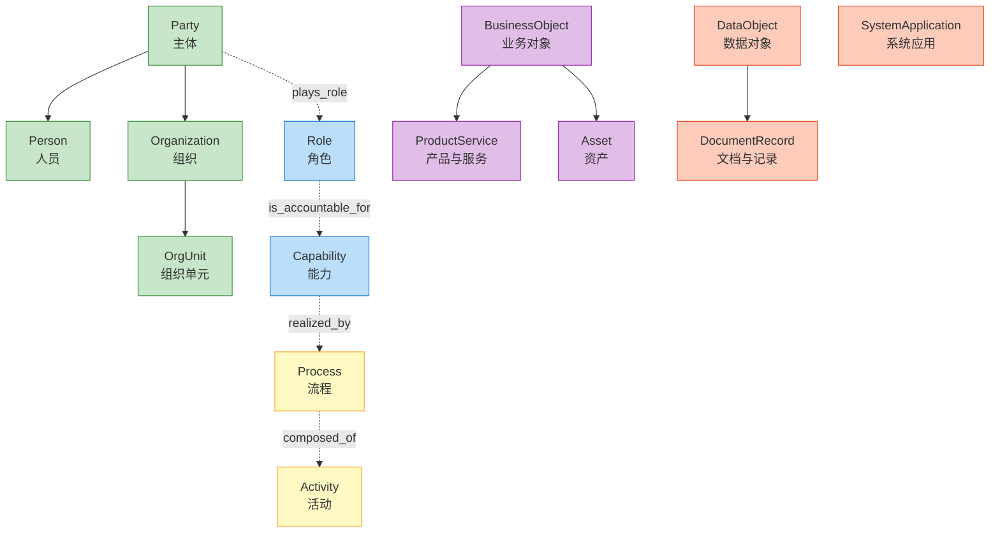

# Core Ontology (L1)

The Universal Enterprise Ontology Core defines **25 classes** and **16 relations** that form the mandatory foundation for all industry addons and enterprise customizations.

## Overview

## Sections

- [Classes Reference](classes.md) — All 25 core classes with definitions
- [Relations Reference](relations.md) — All 16 standard relations
- [Sample Instances](instances.md) — Example data to understand usage
