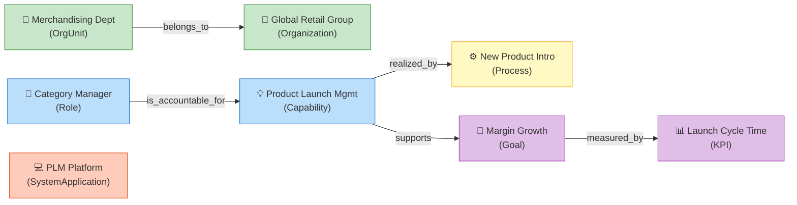

# Sample Instances

The L1 Core includes sample instances to demonstrate how classes are used in practice.

## Instances

| ID | Type | English Label | 中文标签 |
|:---|:---|:---|:---|
| `org_global_retail_group` | Organization | Global Retail Group | 全球零售集团 |
| `ou_merchandising` | OrgUnit | Merchandising Department | 商品部 |
| `role_category_manager` | Role | Category Manager | 品类经理 |
| `cap_product_launch` | Capability | Product Launch Management | 产品上市管理 |
| `proc_new_product_intro` | Process | New Product Introduction | 新品引入流程 |
| `sys_plm` | SystemApplication | PLM Platform | PLM 平台 |
| `goal_margin_growth` | Goal | Gross Margin Growth | 毛利增长 |
| `kpi_launch_cycle_time` | KPI | Launch Cycle Time | 上市周期 |

## Usage Example

These instances demonstrate a complete business narrative:

**Reading the narrative:**

> The **Merchandising Department** (`OrgUnit`) belongs to the **Global Retail Group** (`Organization`). The **Category Manager** (`Role`) is accountable for the **Product Launch Management** capability, which is realized by the **New Product Introduction** process. This capability supports the **Gross Margin Growth** goal, which is measured by the **Launch Cycle Time** KPI.
