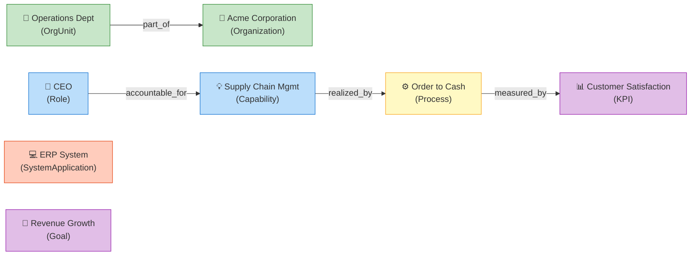

# Sample Instances

The L1 Core includes sample instances to demonstrate how classes are used in practice.

## Instances

| ID | Type | English Label | 中文标签 |
|:---|:---|:---|:---|
| `org_acme_corp` | Organization | Acme Corporation | 示例公司 |
| `ou_operations_dept` | OrgUnit | Operations Department | 运营部 |
| `role_ceo` | Role | Chief Executive Officer | 首席执行官 |
| `cap_supply_chain` | Capability | Supply Chain Management | 供应链管理 |
| `proc_order_to_cash` | Process | Order to Cash | 订单到回款 |
| `sys_erp` | SystemApplication | Enterprise Resource Planning System | 企业资源计划系统 |
| `goal_revenue_growth` | Goal | Revenue Growth | 营收增长 |
| `kpi_customer_satisfaction` | KPI | Customer Satisfaction Score | 客户满意度评分 |

## Usage Example

These instances demonstrate a complete business narrative:

**Reading the narrative:**

> The **Operations Department** (`OrgUnit`) is `part_of` the **Acme Corporation** (`Organization`). The **CEO** (`Role`) is `accountable_for` the **Supply Chain Management** capability, which is `realized_by` the **Order to Cash** process. The process is `measured_by` the **Customer Satisfaction Score** KPI.
