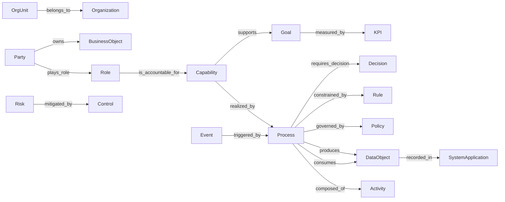

# Relations Reference

All 16 standard relations defined in L1. Each relation connects a **domain** class (source) to a **range** class (target).

---

## Overview Diagram

---

## Party & Organization Relations

### plays_role

| Field | Value |
|:---|:---|
| **ID** | `plays_role` |
| **中文** | 扮演角色 |
| **Domain** | `Party` |
| **Range** | `Role` |
| **Definition** | A party plays a specific role |
| **定义** | 主体扮演某个角色 |

### belongs_to

| Field | Value |
|:---|:---|
| **ID** | `belongs_to` |
| **中文** | 隶属于 |
| **Domain** | `OrgUnit` |
| **Range** | `Organization` |
| **Definition** | An organizational unit belongs to an organization or a parent unit |
| **定义** | 组织单元隶属于组织或上级单元 |

### owns

| Field | Value |
|:---|:---|
| **ID** | `owns` |
| **中文** | 拥有 |
| **Domain** | `Party` |
| **Range** | `BusinessObject` |
| **Definition** | A party owns or is responsible for a business object |
| **定义** | 主体拥有或负责业务对象 |

---

## Capability & Process Relations

### is_accountable_for

| Field | Value |
|:---|:---|
| **ID** | `is_accountable_for` |
| **中文** | 负责 |
| **Domain** | `Role` |
| **Range** | `Capability` |
| **Definition** | A role is accountable for a capability |
| **定义** | 角色对能力负责 |

### realized_by

| Field | Value |
|:---|:---|
| **ID** | `realized_by` |
| **中文** | 由…实现 |
| **Domain** | `Capability` |
| **Range** | `Process` |
| **Definition** | A capability is realized by a process |
| **定义** | 能力由流程实现 |

### composed_of

| Field | Value |
|:---|:---|
| **ID** | `composed_of` |
| **中文** | 由…组成 |
| **Domain** | `Process` |
| **Range** | `Activity` |
| **Definition** | A process is composed of activities |
| **定义** | 流程由活动组成 |

---

## Data Flow Relations

### consumes

| Field | Value |
|:---|:---|
| **ID** | `consumes` |
| **中文** | 消费 |
| **Domain** | `Process` |
| **Range** | `DataObject` |
| **Definition** | A process consumes data objects |
| **定义** | 流程消费数据对象 |

### produces

| Field | Value |
|:---|:---|
| **ID** | `produces` |
| **中文** | 产出 |
| **Domain** | `Process` |
| **Range** | `DataObject` |
| **Definition** | A process produces data objects |
| **定义** | 流程产出数据对象 |

### recorded_in

| Field | Value |
|:---|:---|
| **ID** | `recorded_in` |
| **中文** | 记录于 |
| **Domain** | `DataObject` |
| **Range** | `SystemApplication` |
| **Definition** | A data object is recorded in a system application |
| **定义** | 数据对象记录于系统 |

---

## Governance Relations

### governed_by

| Field | Value |
|:---|:---|
| **ID** | `governed_by` |
| **中文** | 受…治理 |
| **Domain** | `Process` |
| **Range** | `Policy` |
| **Definition** | A process is governed by a policy |
| **定义** | 流程受政策治理 |

### constrained_by

| Field | Value |
|:---|:---|
| **ID** | `constrained_by` |
| **中文** | 受…约束 |
| **Domain** | `Process` |
| **Range** | `Rule` |
| **Definition** | A process is constrained by a rule |
| **定义** | 流程受规则约束 |

### mitigated_by

| Field | Value |
|:---|:---|
| **ID** | `mitigated_by` |
| **中文** | 由…缓释 |
| **Domain** | `Risk` |
| **Range** | `Control` |
| **Definition** | A risk is mitigated by a control measure |
| **定义** | 风险由控制措施缓释 |

---

## Event & Decision Relations

### triggered_by

| Field | Value |
|:---|:---|
| **ID** | `triggered_by` |
| **中文** | 由…触发 |
| **Domain** | `Event` |
| **Range** | `Process` |
| **Definition** | An event triggers a process |
| **定义** | 事件触发流程 |

### requires_decision

| Field | Value |
|:---|:---|
| **ID** | `requires_decision` |
| **中文** | 需要决策 |
| **Domain** | `Process` |
| **Range** | `Decision` |
| **Definition** | A process requires a decision or approval |
| **定义** | 流程需要决策或审批 |

---

## Goal & Measurement Relations

### supports

| Field | Value |
|:---|:---|
| **ID** | `supports` |
| **中文** | 支持 |
| **Domain** | `Capability` |
| **Range** | `Goal` |
| **Definition** | A capability supports a business goal |
| **定义** | 能力支持业务目标 |

### measured_by

| Field | Value |
|:---|:---|
| **ID** | `measured_by` |
| **中文** | 由…衡量 |
| **Domain** | `Goal` |
| **Range** | `KPI` |
| **Definition** | A goal is measured by a KPI |
| **定义** | 目标由指标衡量 |
