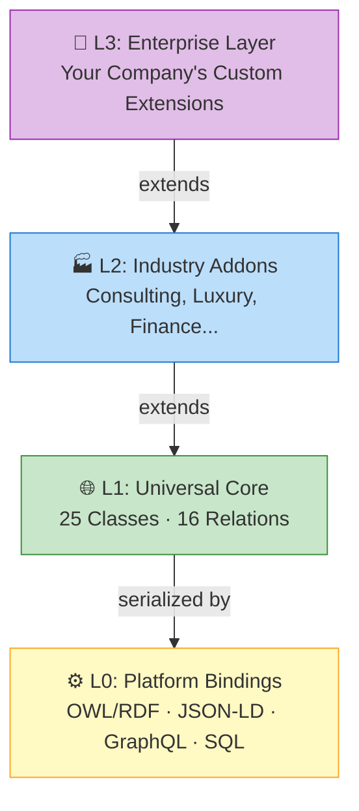

# Getting Started

Welcome to Universal Ontology Definition (UOD)! This section will help you understand what UOD is and how to use it in your projects.

## What is UOD?

UOD is an **open, standardized four-layer enterprise ontology framework** designed to provide a unified conceptual modeling foundation for:

- :brain: **Knowledge Graphs** — Build enterprise knowledge graphs with standardized concepts
- :bar_chart: **Semantic Layers** — Create consistent data semantic layers across systems
- :file_cabinet: **Master Data Management** — Standardize entity definitions across the organization
- :robot: **AI Agent Knowledge Bases** — Provide structured domain knowledge to AI agents

## How It Works

## Next Steps

- [Quick Start](quick-start.md) — Start using UOD in 5 minutes
- [Core Concepts](core-concepts.md) — Understand the key terminology
