# L1 Classes Reference / L1 类参考

All 24 classes defined in L1 Core v2.1, organized by their 4 semantic domains. Each class includes bilingual definitions, hierarchy position, and lifecycle metadata.

L1 Core v2.1 中定义的全部 24 个类，按 4 个语义域组织。每个类包含中英文定义、层次位置和生命周期元数据。

## Full Inheritance Tree / 完整继承树

```mermaid
graph TD
    Entity["Entity 实体 ★"]
    Party["Party 主体"]
    Person["Person 人员"]
    Organization["Organization 组织"]
    OrgUnit["OrgUnit 组织单元"]
    Resource["Resource 资源 ★"]
    ProductService["ProductService 产品与服务"]
    Asset["Asset 资产"]
    DataObject["DataObject 数据对象"]
    Document["Document 文档与记录"]
    SystemApplication["SystemApplication 系统应用"]

    Governance["Governance 治理 ★"]
    Policy["Policy 政策"]
    Rule["Rule 规则"]
    Control["Control 控制"]
    Risk["Risk 风险"]

    Operational["Operational 运营 ★"]
    Role["Role 角色"]
    Capability["Capability 能力"]
    Process["Process 流程"]
    Event["Event 事件"]

    Measurement["Measurement 度量 ★"]
    Goal["Goal 目标"]
    KPI["KPI 关键指标"]

    Entity --> Party --> Person
    Party --> Organization --> OrgUnit
    Entity --> Resource
    Resource --> ProductService
    Resource --> Asset
    Resource --> DataObject --> Document
    Resource --> SystemApplication

    Governance --> Policy
    Governance --> Rule
    Governance --> Control
    Governance --> Risk

    Operational --> Role
    Operational --> Capability
    Operational --> Process
    Operational --> Event

    Measurement --> Goal
    Measurement --> KPI

    style Entity fill:#e3f2fd,stroke:#1565c0
    style Resource fill:#e3f2fd,stroke:#1565c0
    style Governance fill:#ffebee,stroke:#c62828
    style Operational fill:#fff3e0,stroke:#e65100
    style Measurement fill:#f3e5f5,stroke:#6a1b9a
```

★ = Abstract class (cannot be instantiated) / 抽象类（不可实例化）

---

## Entity Domain / 实体域

### Entity (Abstract) / 实体

| Field | Value |
|:---|:---|
| **ID** | `Entity` |
| **ZH** | 实体 |
| **EN** | Entity |
| **Parent** | — (root) |
| **Abstract** | Yes |
| **Since** | v2.0.0 |

**EN**: Top-level abstraction for all identifiable and manageable things. This is an abstract domain root — you cannot create instances of Entity directly; use its concrete subclasses instead.

**ZH**: 所有可被识别和管理的事物的顶层抽象。这是一个抽象域根 — 不能直接创建 Entity 的实例；请使用其具体子类。

---

### Party / 主体

| Field | Value |
|:---|:---|
| **ID** | `Party` |
| **ZH** | 主体 |
| **EN** | Party |
| **Parent** | `Entity` |
| **Abstract** | No |
| **Since** | v1.0.0 |

**EN**: The superclass of all entities that can participate in business and governance relationships. A Party can be a Person (individual) or an Organization (legal entity). Use `Party` when the participant type is unknown or could be either.

**ZH**: 可参与业务关系与治理关系的主体总类。Party 可以是 Person（个人）或 Organization（法人实体）。当参与者类型未知或可能是两者之一时，使用 `Party`。

---

### Person / 人员

| Field | Value |
|:---|:---|
| **ID** | `Person` |
| **ZH** | 人员 |
| **EN** | Person |
| **Parent** | `Party` |
| **Abstract** | No |
| **Since** | v1.0.0 |

**EN**: A natural person entity — an individual human being. Disjoint with Organization (a Person cannot also be an Organization).

**ZH**: 自然人主体 — 一个具体的人。与 Organization 互斥（一个 Person 不能同时是 Organization）。

---

### Organization / 组织

| Field | Value |
|:---|:---|
| **ID** | `Organization` |
| **ZH** | 组织 |
| **EN** | Organization |
| **Parent** | `Party` |
| **Abstract** | No |
| **Since** | v1.0.0 |

**EN**: A legal or non-legal organization entity — companies, NGOs, government agencies, consortiums, etc. Disjoint with Person.

**ZH**: 法人或非法人组织 — 公司、NGO、政府机构、联盟等。与 Person 互斥。

---

### OrgUnit / 组织单元

| Field | Value |
|:---|:---|
| **ID** | `OrgUnit` |
| **ZH** | 组织单元 |
| **EN** | Organizational Unit |
| **Parent** | `Organization` |
| **Abstract** | No |
| **Since** | v1.0.0 |

**EN**: Internal organizational units such as departments, teams, committees, and program groups. An OrgUnit IS-A Organization (it inherits all Organization capabilities), but represents a sub-division rather than a standalone legal entity.

**ZH**: 部门、团队、委员会、项目群等组织内部单元。OrgUnit IS-A Organization（继承所有 Organization 能力），但代表的是子部门而非独立法人。

---

### Resource (Abstract) / 资源

| Field | Value |
|:---|:---|
| **ID** | `Resource` |
| **ZH** | 资源 |
| **EN** | Resource |
| **Parent** | `Entity` |
| **Abstract** | Yes |
| **Since** | v2.0.0 |

**EN**: Tangible or intangible resources created, modified, managed, or consumed by business processes. This is an abstract grouping — use its concrete subclasses (`ProductService`, `Asset`, `DataObject`, `SystemApplication`) instead. Replaced the v1.0 concept `BusinessObject`.

**ZH**: 被业务过程创建、变更、管理、消费的有形或无形资源。这是一个抽象分组 — 请使用其具体子类（`ProductService`、`Asset`、`DataObject`、`SystemApplication`）。替换了 v1.0 的 `BusinessObject` 概念。

---

### ProductService / 产品与服务

| Field | Value |
|:---|:---|
| **ID** | `ProductService` |
| **ZH** | 产品与服务 |
| **EN** | Product & Service |
| **Parent** | `Resource` |
| **Abstract** | No |
| **Since** | v1.0.0 |

**EN**: Products and services provided externally to customers or used internally by an enterprise. Covers both tangible goods and intangible service offerings.

**ZH**: 企业对外提供或内部使用的产品和服务对象。涵盖有形商品和无形服务。

---

### Asset / 资产

| Field | Value |
|:---|:---|
| **ID** | `Asset` |
| **ZH** | 资产 |
| **EN** | Asset |
| **Parent** | `Resource` |
| **Abstract** | No |
| **Since** | v1.0.0 |

**EN**: Financial, physical, knowledge, data, brand, and other assets. Assets are *owned* valuable things, as opposed to generic resources that are merely consumed or produced.

**ZH**: 财务、实物、知识、数据、品牌等资产。资产是*有所属权的*有价值事物，区别于仅被消费或产出的一般资源。

---

### DataObject / 数据对象

| Field | Value |
|:---|:---|
| **ID** | `DataObject` |
| **ZH** | 数据对象 |
| **EN** | Data Object |
| **Parent** | `Resource` |
| **Abstract** | No |
| **Since** | v1.0.0 |

**EN**: A structured or unstructured data entity. This is the broad category for all data — its child class `Document` covers specific business documents like contracts and reports.

**ZH**: 结构化或非结构化的数据实体。这是所有数据的宽泛类别 — 其子类 `Document` 涵盖合同、报告等具体业务文档。

---

### Document / 文档与记录

| Field | Value |
|:---|:---|
| **ID** | `Document` |
| **ZH** | 文档与记录 |
| **EN** | Document |
| **Parent** | `DataObject` |
| **Abstract** | No |
| **Since** | v2.0.0 |
| **Replaced** | `DocumentRecord` (v1.0) |

**EN**: Contracts, reports, files, documents, and records. A specialized subtype of DataObject for business documents with lifecycle management needs.

**ZH**: 合同、报告、文件、单据、记录。DataObject 下的特化子类，用于有生命周期管理需求的业务文档。

---

### SystemApplication / 系统应用

| Field | Value |
|:---|:---|
| **ID** | `SystemApplication` |
| **ZH** | 系统应用 |
| **EN** | System Application |
| **Parent** | `Resource` |
| **Abstract** | No |
| **Since** | v1.0.0 |

**EN**: Software systems supporting processes, data, and decision-making. Includes ERP, CRM, data platforms, and any enterprise application.

**ZH**: 支撑流程、数据和决策的软件系统。包括 ERP、CRM、数据平台以及任何企业应用。

---

## Governance Domain / 治理域

### Governance (Abstract) / 治理

| Field | Value |
|:---|:---|
| **ID** | `Governance` |
| **ZH** | 治理 |
| **EN** | Governance |
| **Parent** | — (root) |
| **Abstract** | Yes |
| **Since** | v2.0.0 |

**EN**: Abstract domain for constraints, governance, and risk management. Contains four concrete subclasses that form a governance cascade: Policy (why) → Rule (what) → Control (how), plus Risk.

**ZH**: 用于约束、治理和风险管控的抽象域。包含四个具体子类，形成治理级联：Policy（为什么）→ Rule（做什么）→ Control（怎么做），加上 Risk。

---

### Policy / 政策

| Field | Value |
|:---|:---|
| **ID** | `Policy` |
| **ZH** | 政策 |
| **EN** | Policy |
| **Parent** | `Governance` |
| **Abstract** | No |
| **Since** | v1.0.0 |

**EN**: Management principles and constraint requirements. Policies express *why* certain governance exists — they are high-level directives, not executable rules.

**ZH**: 管理原则与约束要求。政策表达*为什么*需要某种治理 — 它们是高层指令，不是可执行的规则。

---

### Rule / 规则

| Field | Value |
|:---|:---|
| **ID** | `Rule` |
| **ZH** | 规则 |
| **EN** | Rule |
| **Parent** | `Governance` |
| **Abstract** | No |
| **Since** | v1.0.0 |

**EN**: Executable and evaluable business or control rules. Rules express *what* must be done — they can be checked, tested, and automated. Disjoint with Policy (a Rule is not a Policy).

**ZH**: 可执行、可判断的业务或控制规则。规则表达*做什么* — 它们可以被检查、测试和自动化。与 Policy 互斥（Rule 不是 Policy）。

---

### Control / 控制

| Field | Value |
|:---|:---|
| **ID** | `Control` |
| **ZH** | 控制 |
| **EN** | Control |
| **Parent** | `Governance` |
| **Abstract** | No |
| **Since** | v1.0.0 |

**EN**: Control measures to reduce risk and ensure compliance and quality. Controls express *how* governance is implemented — they are concrete actions, procedures, or mechanisms.

**ZH**: 用于降低风险、保障合规和质量的控制措施。控制表达*怎么做* — 它们是具体的行动、程序或机制。

---

### Risk / 风险

| Field | Value |
|:---|:---|
| **ID** | `Risk` |
| **ZH** | 风险 |
| **EN** | Risk |
| **Parent** | `Governance` |
| **Abstract** | No |
| **Since** | v1.0.0 |

**EN**: Uncertain events or conditions that may affect goal achievement. Risks are mitigated by Controls (`mitigated_by` relation).

**ZH**: 可能影响目标实现的不确定事件或状态。风险由控制措施缓释（`mitigated_by` 关系）。

---

## Operational Domain / 运营域

### Operational (Abstract) / 运营

| Field | Value |
|:---|:---|
| **ID** | `Operational` |
| **ZH** | 运营 |
| **EN** | Operational |
| **Parent** | — (root) |
| **Abstract** | Yes |
| **Since** | v2.0.0 |

**EN**: Abstract domain describing how an organization operates, including roles, capabilities, processes, and events.

**ZH**: 描述组织运作方式的抽象域，包含角色、能力、流程与事件。

---

### Role / 角色

| Field | Value |
|:---|:---|
| **ID** | `Role` |
| **ZH** | 角色 |
| **EN** | Role |
| **Parent** | `Operational` |
| **Abstract** | No |
| **Since** | v1.0.0 |

**EN**: An identity or responsibility assumed by a Party in a given context. A Party `plays_role` a Role. Roles are context-dependent — the same Person can play different Roles in different situations.

**ZH**: 主体在某一上下文中承担的身份或职责。Party 通过 `plays_role` 扮演 Role。角色是上下文相关的 — 同一 Person 在不同场景下可以扮演不同 Role。

---

### Capability / 能力

| Field | Value |
|:---|:---|
| **ID** | `Capability` |
| **ZH** | 能力 |
| **EN** | Capability |
| **Parent** | `Operational` |
| **Abstract** | No |
| **Since** | v1.0.0 |

**EN**: A stable and reusable business capability possessed by an organization. Capabilities describe *what* the organization can do (enduring), and are `realized_by` Processes that describe *how* it is done (executable).

**ZH**: 组织稳定具备且可被复用的业务能力。能力描述组织*能做什么*（持久性），通过 `realized_by` 连接到描述*怎么做*的流程（可执行性）。

---

### Process / 流程

| Field | Value |
|:---|:---|
| **ID** | `Process` |
| **ZH** | 流程 |
| **EN** | Process |
| **Parent** | `Operational` |
| **Abstract** | No |
| **Since** | v1.0.0 |

**EN**: An end-to-end sequence of activities defined to achieve business objectives. Sub-activities are expressed via the `part_of` relation (rather than a separate Activity class at L1). Processes `consume` and `produce` Resources.

**ZH**: 为实现业务目标而定义的端到端活动序列。子活动通过 `part_of` 关系表达（L1 不设独立的 Activity 类）。流程通过 `consumes` 和 `produces` 消费和产出资源。

---

### Event / 事件

| Field | Value |
|:---|:---|
| **ID** | `Event` |
| **ZH** | 事件 |
| **EN** | Event |
| **Parent** | `Operational` |
| **Abstract** | No |
| **Since** | v1.0.0 |

**EN**: A state change occurring in the business or technical environment. Events are instantaneous (point-in-time) and can trigger Processes via the `triggered_by` relation.

**ZH**: 发生在业务或技术环境中的状态变化。事件是瞬时的（时间点）并可通过 `triggered_by` 关系触发流程。

---

## Measurement Domain / 度量域

### Measurement (Abstract) / 度量

| Field | Value |
|:---|:---|
| **ID** | `Measurement` |
| **ZH** | 度量 |
| **EN** | Measurement |
| **Parent** | — (root) |
| **Abstract** | Yes |
| **Since** | v2.0.0 |

**EN**: Abstract domain for goal-setting and performance measurement.

**ZH**: 描述目标设定与绩效衡量的抽象域。

---

### Goal / 目标

| Field | Value |
|:---|:---|
| **ID** | `Goal` |
| **ZH** | 目标 |
| **EN** | Goal |
| **Parent** | `Measurement` |
| **Abstract** | No |
| **Since** | v1.0.0 |

**EN**: Outcomes an organization aims to achieve. Goals are qualitative or directional ("increase revenue", "improve customer satisfaction"). They are tracked by KPIs.

**ZH**: 组织希望达成的结果。目标是定性或方向性的（"增加收入"、"提升客户满意度"）。通过 KPI 跟踪。

---

### KPI / 关键指标

| Field | Value |
|:---|:---|
| **ID** | `KPI` |
| **ZH** | 关键指标 |
| **EN** | Key Performance Indicator |
| **Parent** | `Measurement` |
| **Abstract** | No |
| **Since** | v1.0.0 |

**EN**: Metrics that measure the degree of goal achievement. KPIs are quantitative and measurable ("Customer Satisfaction Score ≥ 90%"). Operational elements are `measured_by` KPIs.

**ZH**: 衡量目标达成程度的指标。KPI 是定量且可衡量的（"客户满意度评分 ≥ 90%"）。运营元素通过 `measured_by` 被 KPI 衡量。

---

## Deprecated Classes / 废弃类

These classes were removed or demoted from L1 in v2.0.0. They remain documented for migration purposes.

这些类在 v2.0.0 中从 L1 移除或降级。保留文档以供迁移参考。

| Former Class | Replacement | Migration Note |
|:---|:---|:---|
| `BusinessObject` | `Resource` | Was overly broad; Resource is a more precise abstract parent |
| `DocumentRecord` | `Document` | Simplified naming; Document conveys the same semantics |
| `Activity` | — | Sub-activities now expressed via `part_of` on Process; moved to L2 Common as `Activity` subtype of Process |
| `Channel` | — | Demoted to L2 Common Extension; not universally applicable |
| `MarketSegment` | — | Demoted to L2 Common Extension; marketing-domain concept |
| `Location` | — | Demoted to L2 Common Extension; can be modeled as attribute |
| `Decision` | `Event` | Can be modeled as an Event subtype in L2; semantically a state change |

## Quick Reference Table (auto-generated)

The table below is regenerated from `l1-core/universal_ontology_v1.json` by
`scripts/generate_glossary.py` on every docs build, so it never drifts from
the source-of-truth JSON. Hand-editing this section has no effect — update
the JSON instead.


