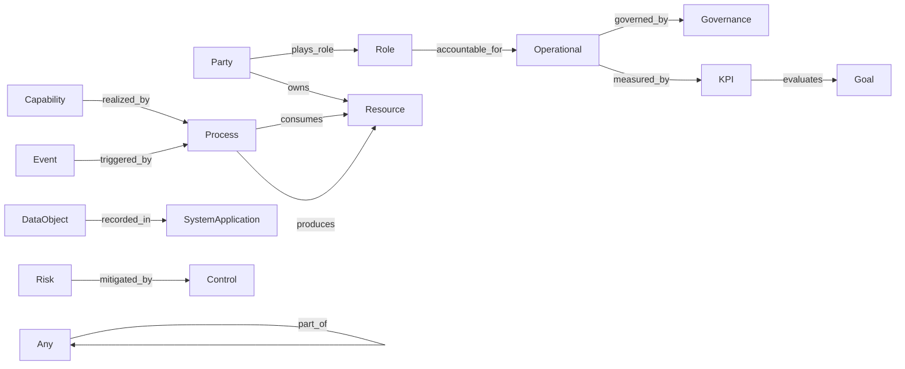

# L1 Relations Reference / L1 关系参考

All 13 standard relations defined in L1 Core v2.0, plus 6 deprecated relations with migration guidance.

L1 Core v2.0 中定义的全部 13 个标准关系，以及 6 个废弃关系及迁移指南。

## Relation Map / 关系总图

---

## Active Relations / 现行关系

### plays_role / 扮演角色

| Field | Value |
|:---|:---|
| **ID** | `plays_role` |
| **ZH** | 扮演角色 |
| **EN** | plays role |
| **Domain** | `Party` |
| **Range** | `Role` |
| **Cardinality** | N:M |

**EN**: A party plays a specific role. The same Party can play multiple Roles, and the same Role can be played by multiple Parties.

**ZH**: 主体扮演某个角色。同一 Party 可扮演多个 Role，同一 Role 可被多个 Party 扮演。

---

### part_of / 属于/组成

| Field | Value |
|:---|:---|
| **ID** | `part_of` |
| **ZH** | 属于/组成 |
| **EN** | part of |
| **Domain** | `Any` (null) |
| **Range** | `Any` (null) |
| **Cardinality** | N:1 |
| **Inverse** | `has_part` |
| **Since** | v2.0.0 |

**EN**: An entity is part of another entity. This is the universal containment/composition relation — it unifies the deprecated `belongs_to` and `composed_of` into a single relation. Axioms: transitive (`ax_part_of_transitive`) and asymmetric (`ax_part_of_asymmetric`).

**ZH**: 一个实体是另一个实体的组成部分。这是通用的包含/组成关系 — 将废弃的 `belongs_to` 和 `composed_of` 合并为一个关系。公理：传递性（`ax_part_of_transitive`）和非对称性（`ax_part_of_asymmetric`）。

---

### owns / 拥有

| Field | Value |
|:---|:---|
| **ID** | `owns` |
| **ZH** | 拥有 |
| **EN** | owns |
| **Domain** | `Party` |
| **Range** | `Resource` |
| **Cardinality** | 1:N |

**EN**: A party owns or is responsible for a resource. Restricted by axiom `ax_owns_domain_party`: only Party subclasses can own Resource subclasses.

**ZH**: 主体拥有或负责资源。受公理 `ax_owns_domain_party` 约束：只有 Party 子类可拥有 Resource 子类。

---

### accountable_for / 负责

| Field | Value |
|:---|:---|
| **ID** | `accountable_for` |
| **ZH** | 负责 |
| **EN** | accountable for |
| **Domain** | `Role` |
| **Range** | `Operational` |
| **Cardinality** | N:M |
| **Since** | v2.0.0 |

**EN**: A role is accountable for an operational element (capability, process, etc.). This generalizes the former `is_accountable_for` relation.

**ZH**: 角色对运营元素（能力、流程等）负责。泛化了原 `is_accountable_for` 关系。

---

### realized_by / 由…实现

| Field | Value |
|:---|:---|
| **ID** | `realized_by` |
| **ZH** | 由…实现 |
| **EN** | realized by |
| **Domain** | `Capability` |
| **Range** | `Process` |
| **Cardinality** | N:M |

**EN**: A capability is realized by a process. This is the key bridge between *what an org can do* (Capability) and *how it does it* (Process). Axiom: every Capability must be realized by at least one Process (`ax_process_realizes_capability`).

**ZH**: 能力由流程实现。这是*组织能做什么*（Capability）与*怎么做*（Process）之间的关键桥梁。公理：每个 Capability 必须至少由一个 Process 实现（`ax_process_realizes_capability`）。

---

### consumes / 消费

| Field | Value |
|:---|:---|
| **ID** | `consumes` |
| **ZH** | 消费 |
| **EN** | consumes |
| **Domain** | `Process` |
| **Range** | `Resource` |
| **Cardinality** | N:M |

**EN**: A process consumes resources as inputs.

**ZH**: 流程消费资源作为输入。

---

### produces / 产出

| Field | Value |
|:---|:---|
| **ID** | `produces` |
| **ZH** | 产出 |
| **EN** | produces |
| **Domain** | `Process` |
| **Range** | `Resource` |
| **Cardinality** | N:M |

**EN**: A process produces resources as outputs.

**ZH**: 流程产出资源作为输出。

---

### recorded_in / 记录于

| Field | Value |
|:---|:---|
| **ID** | `recorded_in` |
| **ZH** | 记录于 |
| **EN** | recorded in |
| **Domain** | `DataObject` |
| **Range** | `SystemApplication` |
| **Cardinality** | N:M |

**EN**: A data object is recorded in a system application. This links data to the systems that store or manage it.

**ZH**: 数据对象记录于系统应用中。这将数据与存储或管理它的系统关联起来。

---

### governed_by / 受…治理

| Field | Value |
|:---|:---|
| **ID** | `governed_by` |
| **ZH** | 受…治理 |
| **EN** | governed by |
| **Domain** | `Operational` |
| **Range** | `Governance` |
| **Cardinality** | N:M |
| **Since** | v2.0.0 |

**EN**: An operational element is governed by a governance element. This generalizes both the former `governed_by` and `constrained_by` relations. Axiom: range restricted to Governance subclasses (`ax_governed_by_range_governance`).

**ZH**: 运营元素受治理要素约束。泛化了原 `governed_by` 和 `constrained_by` 两个关系。公理：值域限制为 Governance 子类（`ax_governed_by_range_governance`）。

---

### mitigated_by / 由…缓释

| Field | Value |
|:---|:---|
| **ID** | `mitigated_by` |
| **ZH** | 由…缓释 |
| **EN** | mitigated by |
| **Domain** | `Risk` |
| **Range** | `Control` |
| **Cardinality** | N:M |

**EN**: A risk is mitigated by a control measure. Axiom: every Risk must be mitigated by at least one Control (`ax_risk_mitigated_by_control`).

**ZH**: 风险由控制措施缓释。公理：每个 Risk 至少由一个 Control 缓释（`ax_risk_mitigated_by_control`）。

---

### triggered_by / 由…触发

| Field | Value |
|:---|:---|
| **ID** | `triggered_by` |
| **ZH** | 由…触发 |
| **EN** | triggered by |
| **Domain** | `Event` |
| **Range** | `Process` |
| **Cardinality** | N:M |

**EN**: An event triggers a process. Events are state changes that initiate process execution.

**ZH**: 事件触发流程。事件是引发流程执行的状态变化。

---

### measured_by / 由…衡量

| Field | Value |
|:---|:---|
| **ID** | `measured_by` |
| **ZH** | 由…衡量 |
| **EN** | measured by |
| **Domain** | `Operational` |
| **Range** | `KPI` |
| **Cardinality** | N:M |
| **Since** | v2.0.0 |

**EN**: An operational element is measured by a KPI. This generalizes the former Goal-only constraint — now any Operational element (Role, Capability, Process, Event) can be measured.

**ZH**: 运营元素由指标衡量。泛化了原仅限 Goal 的约束 — 现在任何运营元素（Role、Capability、Process、Event）都可被衡量。

---

### evaluates / 评估

| Field | Value |
|:---|:---|
| **ID** | `evaluates` |
| **ZH** | 评估 |
| **EN** | evaluates |
| **Domain** | `KPI` |
| **Range** | `Goal` |
| **Cardinality** | N:M |
| **Since** | v2.1.0 |

**EN**: A KPI evaluates the achievement of a specific business goal.

**ZH**: 关键指标用于评估特定业务目标的达成情况。

---

## Deprecated Relations / 废弃关系

These relations were removed from L1 in v2.0.0. Use their replacements instead.

这些关系在 v2.0.0 中从 L1 移除。请使用替代关系。

| Former Relation | Replaced By | Migration Note |
|:---|:---|:---|
| `belongs_to` | `part_of` | Merged into the unified containment relation |
| `composed_of` | `part_of` | Merged into the unified containment relation |
| `is_accountable_for` | `accountable_for` | Simplified naming |
| `constrained_by` | `governed_by` | Merged into the generalized governance relation |
| `supports` | — | Expressible via `measured_by` inverse reasoning or Goal-Capability mapping in L2 |
| `requires_decision` | — | Decision demoted to L2; expressible as Event subtype |
