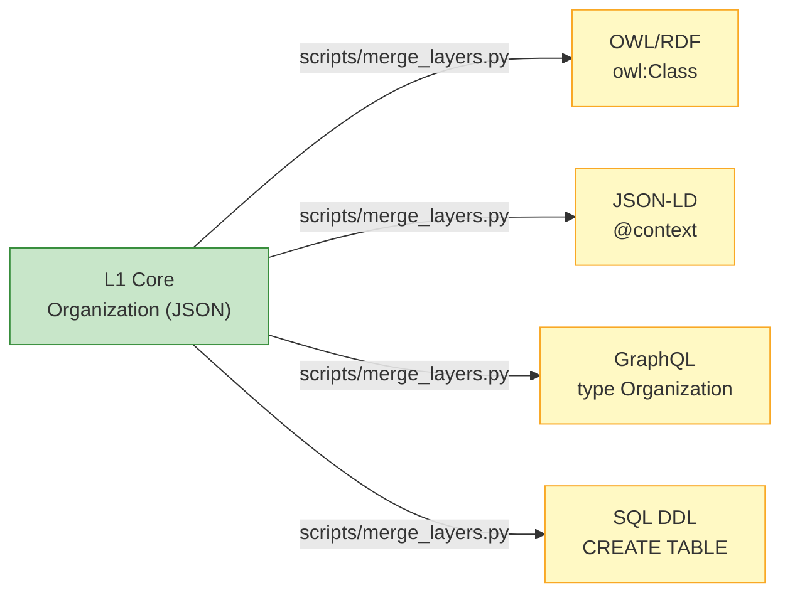

# Platform Bindings (L0) | 平台绑定层

The L0 layer provides pre-built serializations of the L1 semantic model for different technology platforms.
L0 层提供了 L1 语义模型到不同技术平台的预构建序列化映射。

!!! info "What does L0 do? | L0 的作用是什么？"
    L0 **does not** participate in the semantic inheritance chain (L1 → L2 → L3). There are no new semantic concepts or business logic introduced in L0. Instead, it provides a mechanisms for taking the unified business semantics and automatically compiling them into executable code for actual software platforms via AST parsing.

## Available Target Formats | 可用的目标格式

- **[SQL DDL](sql-ddl.md)**: For relational databases like PostgreSQL. Maps concepts to relational tables.
- **[GraphQL Schema](graphql.md)**: For API integration. Maps concepts to strong types and interfaces.
- **[JSON-LD](json-ld.md)**: For Web-scale interoperability. Maps vocabularies to global URIs.
- **[OWL/RDF](owl-rdf.md)**: For Semantic Web reasoning engines.

## Generator Mechanism | 生成器机制

L0 is completely **data-driven**. The scripts inside the `scripts/` directory traverse the `classes` and `relations` defined by your ontology files and dynamically project them into the target format.

