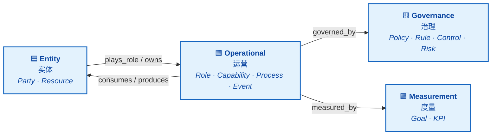
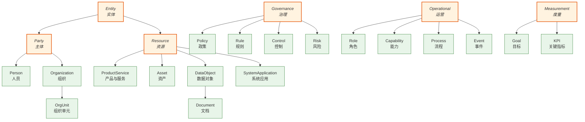

# Core Ontology (L1)

The Universal Enterprise Ontology Core defines **24 classes** and **13 relations** that form the mandatory foundation for all Industry and Domain Extension and enterprise customizations.

The 24 classes are organized under **4 abstract domains** (Entity, Governance, Operational, Measurement). Within the Entity domain, two intermediate abstractions — `Party` and `Resource` — group related concrete classes and serve as relation signatures (e.g. `owns: Party → Resource`). In total: **6 abstract classes** (4 domain roots + 2 intermediate) and **18 concrete leaf classes**.

## High-Level Architecture

The four abstract domains are mutually disjoint (enforced by axioms `ax_entity_governance_disjoint`, etc.). Cross-domain relations bind them into a coherent operating model:

## Full Inheritance Tree

All 24 L1 classes with parent–child relationships. Abstract classes are shown in italic / orange; concrete leaves in green.

## Sections

- [Classes Reference](classes.md) — All 24 core classes with definitions
- [Relations Reference](relations.md) — All 13 standard relations
- [Axioms Reference](axioms.md) — 18 OWL 2 semantic constraints
- [Sample Instances](instances.md) — Example data to understand usage
