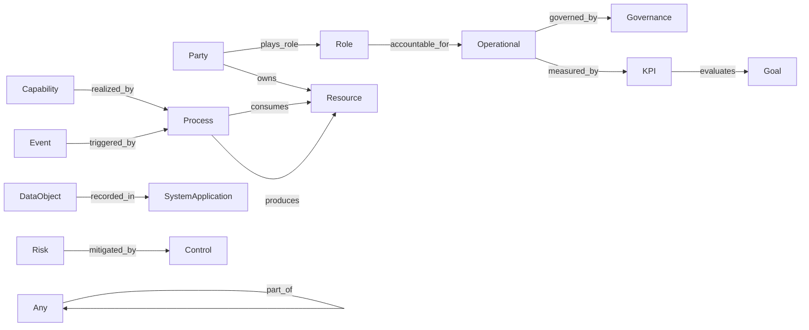

# Relations Reference

All 13 standard relations defined in L1 v2.0. Each relation connects a **domain** class (source) to a **range** class (target) and includes cardinality definitions.

---

## Overview Diagram

---

## Party & Entity Relations

### plays_role

| Field | Value |
|:---|:---|
| **ID** | `plays_role` |
| **中文** | 扮演角色 |
| **Domain** | `Party` |
| **Range** | `Role` |
| **Cardinality** | N:M |
| **Definition** | A party plays a specific role |
| **定义** | 主体扮演某个角色 |

### part_of

| Field | Value |
|:---|:---|
| **ID** | `part_of` |
| **中文** | 属于/组成 |
| **Domain** | `Any` (null) |
| **Range** | `Any` (null) |
| **Cardinality** | N:1 |
| **Definition** | An entity is part of another entity (unifies belongs_to and composed_of) |
| **定义** | 一个实体是另一个实体的组成部分（合并了 belongs_to 和 composed_of） |

### owns

| Field | Value |
|:---|:---|
| **ID** | `owns` |
| **中文** | 拥有 |
| **Domain** | `Party` |
| **Range** | `Resource` |
| **Cardinality** | 1:N |
| **Definition** | A party owns or is responsible for a resource |
| **定义** | 主体拥有或负责资源 |

---

## Operational & Governance Relations

### accountable_for

| Field | Value |
|:---|:---|
| **ID** | `accountable_for` |
| **中文** | 负责 |
| **Domain** | `Role` |
| **Range** | `Operational` |
| **Cardinality** | N:M |
| **Definition** | A role is accountable for an operational element (capability, process, etc.) |
| **定义** | 角色对运营元素（能力、流程等）负责 |

### realized_by

| Field | Value |
|:---|:---|
| **ID** | `realized_by` |
| **中文** | 由…实现 |
| **Domain** | `Capability` |
| **Range** | `Process` |
| **Cardinality** | N:M |
| **Definition** | A capability is realized by a process |
| **定义** | 能力由流程实现 |

### governed_by

| Field | Value |
|:---|:---|
| **ID** | `governed_by` |
| **中文** | 受…治理 |
| **Domain** | `Operational` |
| **Range** | `Governance` |
| **Cardinality** | N:M |
| **Definition** | An operational element is governed by a governance element (generalizes both governed_by and constrained_by) |
| **定义** | 运营元素受治理要素约束（泛化了原 governed_by 和 constrained_by） |

### mitigated_by

| Field | Value |
|:---|:---|
| **ID** | `mitigated_by` |
| **中文** | 由…缓释 |
| **Domain** | `Risk` |
| **Range** | `Control` |
| **Cardinality** | N:M |
| **Definition** | A risk is mitigated by a control measure |
| **定义** | 风险由控制措施缓释 |

---

## Data & System Relations

### consumes

| Field | Value |
|:---|:---|
| **ID** | `consumes` |
| **中文** | 消费 |
| **Domain** | `Process` |
| **Range** | `Resource` |
| **Cardinality** | N:M |
| **Definition** | A process consumes resources |
| **定义** | 流程消费资源 |

### produces

| Field | Value |
|:---|:---|
| **ID** | `produces` |
| **中文** | 产出 |
| **Domain** | `Process` |
| **Range** | `Resource` |
| **Cardinality** | N:M |
| **Definition** | A process produces resources |
| **定义** | 流程产出资源 |

### recorded_in

| Field | Value |
|:---|:---|
| **ID** | `recorded_in` |
| **中文** | 记录于 |
| **Domain** | `DataObject` |
| **Range** | `SystemApplication` |
| **Cardinality** | N:M |
| **Definition** | A data object is recorded in a system application |
| **定义** | 数据对象记录于系统 |

---

## Event & Measurement Relations

### triggered_by

| Field | Value |
|:---|:---|
| **ID** | `triggered_by` |
| **中文** | 由…触发 |
| **Domain** | `Event` |
| **Range** | `Process` |
| **Cardinality** | N:M |
| **Definition** | An event triggers a process |
| **定义** | 事件触发流程 |

### measured_by

| Field | Value |
|:---|:---|
| **ID** | `measured_by` |
| **中文** | 由…衡量 |
| **Domain** | `Operational` |
| **Range** | `KPI` |
| **Cardinality** | N:M |
| **Definition** | An operational element is measured by a KPI (generalizes the former Goal-only constraint) |
| **定义** | 运营元素由指标衡量（泛化了原 Goal→KPI 的限制） |

### evaluates

| Field | Value |
|:---|:---|
| **ID** | `evaluates` |
| **中文** | 评估 |
| **Domain** | `KPI` |
| **Range** | `Goal` |
| **Cardinality** | N:M |
| **Definition** | A KPI evaluates the achievement of a specific business goal |
| **定义** | 关键指标用于评估特定业务目标的达成情况 |
